# PS_project

Pinky 주행 로봇과 OMX 로봇팔을 활용한 **무인마트 자동화 시스템**입니다.

고객이 웹에서 주문하면 관제 PC가 idle 카트에 미션을 할당하고, 카트는 매대(W1–W6) → 계산대(C) → 운송대기(P) → 대기장소(S1/S2)를 순회합니다. 매대에서는 ArUco 도킹 후 **진열대 OMX(:8080)** 가 주문 수량만큼 카트 적재함에 상품을 담고, 계산대에서는 **포장 OMX(:8081)** 가 적재함을 비웁니다. LCD는 대기·이동·적재·결제 상태에 맞는 GIF를 표시합니다.

| 디렉터리 | 역할 |
|----------|------|
| [`server/`](server/) | 쇼핑몰 UI · BFF · 관제(Flask) · SQLite |
| [`pinky/`](pinky/) | 주행 로봇 HTTP API + ROS2/Nav2 + LCD emotion |
| [`omx/`](omx/) | 진열대 pick `:8080` · 계산대 pack `:8081` (별도 PC) |

하위 상세: [server/README.md](server/README.md) · [pinky/README.md](pinky/README.md) · [omx/README.md](omx/README.md)

## 목차

1. [기본 구상](#1-기본-구상)
2. [주요 기능 상세](#2-주요-기능-상세) (기능 설명 + **구현 로직**)
3. [시스템 아키텍처](#3-시스템-아키텍처)
4. [컴포넌트 UML](#4-컴포넌트-uml-개념)
5. [데이터 모델 (ERD)](#5-데이터-모델-erd)
6. [상태 다이어그램](#6-상태-다이어그램)
7. [시퀀스 다이어그램](#7-시퀀스-다이어그램)
8. [패키지·디렉터리 구조](#8-패키지디렉터리-구조)
9. [주요 API 그룹](#9-주요-api-그룹)
10. [환경 변수](#10-환경-변수-핵심)
11. [기동 순서](#11-기동-순서-요약)
12. [설계 원칙](#12-설계-원칙-요약)
13. [시행착오·교훈](#13-시행착오교훈)
14. [관련 문서](#14-관련-문서)

---

## 1. 기본 구상

### 1.1 목표

- **무인 피킹·운반**: 주문 → 자동 할당 → 매대 픽업 → 계산대 포장 → 운송대기 → 홈 복귀
- **다로봇 병행**: 카트 2대 이상 동시 미션, 경로/존 충돌 시 한쪽 대기·W7 스테이징
- **OMX 직렬화**: 진열대 팔·계산대 팔 각각 1대 → 카트 간 작업을 **도킹 완료 FIFO**로 직렬화
- **상태 LCD**: S1/S2 대기 `pinky_charging` · 이동 `pinky_moving` · 매대 적재 `pinky_loading` · 계산대 `pinky_payment`
- **재고·주문 연동**: 상품 최대 재고 3, 주문 시 차감, 관리자/서버 기동 시 재고 초기화

### 1.2 역할 분담

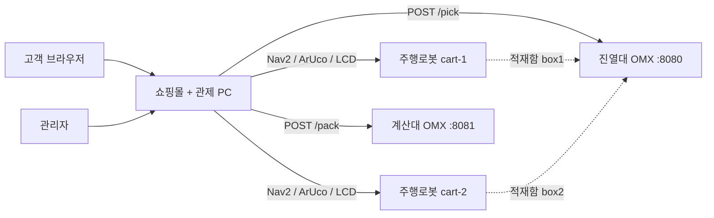

| 주체 | 담당 |
|------|------|
| 관제 PC (`server`) | 주문·재고·미션 FIFO·교통 제어·Pinky/OMX HTTP 오케스트레이션·LCD 상태 |
| Pinky (`pinky`) | 로컬라이즈, Nav2 주행, ArUco 도킹/언독, 센서, LCD emotion_server |
| OMX 진열대 (`:8080`) | 매대 상품 인식·픽업·카트 박스 적재 (수량 1–3) |
| OMX 계산대 (`:8081`) | 적재함 비우기(pack) |

### 1.3 맵 웨이포인트

| ID | 의미 | 비고 |
|----|------|------|
| S1 / S2 | cart-1 / cart-2 대기장소(홈) | 미션 시작·종료 · LCD charging |
| W1–W6 | 매대 | slug: cake, roll-cake, milk, biscuit, ice-cream, sandwich |
| C | 계산대 | ArUco standoff **40cm** → pack OMX → (C는 undock 없음) |
| P | 운송대기 | 상대 홈 복귀 중이면 W7 대기 후 진입 |
| W7 | 교통 스테이징 | 존/충돌 대기 시 바닥에서 이동 |

W6(샌드위치)와 C는 맵상 동일 구역으로 취급(한쪽 점유 = 양쪽 점유).

---

## 2. 주요 기능 상세

각 절은 **무엇을 하는지**와 **코드상 어떻게 흘러가는지(구현 로직)** 를 함께 적습니다.

### 2.1 고객 쇼핑몰 (Web)

구현: `server/apps/web` · BFF `server/apps/web-server`

| 기능 | 설명 |
|------|------|
| 상품 브라우징 | 카테고리·피처드(히어로)·상세. slug로 매대와 연결 |
| 장바구니 | 로그인 카트(DB) / 비로그인 게스트(로컬). 로그인 시 merge |
| 수량 제한 | UI·API 모두 `quantity ≤ stock` 및 상한 3 |
| 주문 | `POST /orders` → 미션 생성·카트 비움·즉시 디스패치 시도 |
| 주문 조회 | 주문·미션 상태·현재 웨이포인트 표시 |

**구현 로직**

```text
Browser
  → Next.js (apps/web) 가 BFF :4000 호출 (JWT)
  → Nest BFF가 CONTROLLER_URL(:4100)로 프록시
  → Flask Products/Carts/Orders 서비스가 SQLite 갱신
  → 주문 생성 응답에 mission 상태 포함 → UI 폴링/표시
```

- 게스트 카트는 브라우저 로컬, 로그인 시 BFF가 서버 카트와 merge.
- 담기/수량 변경은 `CartsService`에서 `stock`·`PRODUCT_MAX_STOCK(3)`를 이중 검사.
- 품절(`stock=0`)이면 UI에서 담기 비활성 + API도 거부.

### 2.2 관리자 (Admin)

구현: `server/apps/web` `/admin/*` · BFF AdminGuard

| 기능 | 설명 |
|------|------|
| 상품 CRUD | 이름, **slug**(W1–W6 매칭), 가격, 재고(0–3), 이미지, 히어로·활성 |
| 재고초기화 | 전 상품 `stock=3` (`POST /admin/products/reset-stock`) |
| 주문·미션 모니터링 | 상태·할당 카트·현재 웨이포인트 |
| 로봇 운영 | 텔레메트리, 강제 정지(abort), 홈 복귀, 맵/센서·OMX 헬스 프록시 |

slug 예: `cake`→W1, `roll-cake`→W2, `milk`→W3, `biscuit`→W4, `ice-cream`→W5, `sandwich`→W6.

**구현 로직**

```text
Admin UI
  → BFF AdminGuard (role=admin)
  → Controller ProductsService / OrdersService / Robot 프록시
  → 로봇 패널: BFF가 PINKY_ROBOTS 각 URL /health·센서·맵 병합
  → abort / return-home: Controller가 미션 FAILED·Nav stop·홈 Nav
```

- slug는 투어 경로의 유일한 매대 키(`SLUG_TO_WAYPOINT`). 잘못 넣면 해당 상품이 투어에서 빠지거나 잘못된 W*로 감.
- 관제 기동 시 `reset_all_stock(3)`으로 데모 재고를 맞춘다.

### 2.3 주문 생성·재고 차감

구현: `OrdersService.create_from_cart` · `CartsService` · `constants.PRODUCT_MAX_STOCK`

**구현 로직**

```text
1. 장바구니 로드 → 라인별 qty ≤ stock, qty ≤ 3 검증 (실패 시 주문 거부)
2. 동일 SQLite 트랜잭션:
     UPDATE products SET stock = stock - qty
     INSERT orders / order_items(스냅샷) / missions(status=CREATED, device_id=NULL)
3. 카트 비우기
4. try_dispatch() 즉시 호출 (idle 카트 있으면 ASSIGNED)
```

픽업 성공 여부와 무관하게 **주문 시점에 재고가 확정**됩니다. 데모 복구는 관리자 재고초기화 또는 관제 재기동.

### 2.4 미션 디스패치 (FIFO)

구현: `OrdersService.try_dispatch` · `_dispatch_lock`

**구현 로직**

```text
try_dispatch (락으로 단일 실행):
  reclaim_stale_carts()           # orphan busy / stuck ASSIGNED 정리
  대기 미션 = CREATED|QUEUED AND device_id IS NULL  (created_at ASC)
  idle cart devices 순회
  미션 ↔ 카트 1:1 할당:
    missions → ASSIGNED, devices → busy
    traffic.register_mission (FIFO 홈출발 시각)
    Thread(_run_pick_tour) 기동
```

- 카트당 동시에 하나의 투어 스레드(`_device_tour_lock`).
- `reclaim`: busy인데 활성 미션 없음 → idle. ASSIGNED가 `PICK_ASSIGNED_STUCK_SEC` 초과 → FAILED.

### 2.5 피킹 투어 (매대 → C → P → 홈)

구현: `_run_pick_tour` · `waypoints.py`

**구현 로직 (한 주문)**

```text
order_items → slug별 수량 합산
  → waypoint_ids_for_slugs
  → conflict_aware_tour_order( defer = peer가 점유한 매대 )
  → remaining = [W*…] + [C, P]

for each shelf W*:
  acquire_waypoint_zone          # peer 점유면 홈/W7에서 매대 대기
  nav_or_fail (traffic leg)      # LCD moving
  aruco_dock (standoff 7cm)
  OmxFifoGate(shelf) enqueue     # 도킹 완료 순
  OMX pick (수량)                # LCD loading
  undock → release zone
  (TrafficYieldError 1회: 해당 매대 defer 후 재시도 / 재큐)

CHECKOUT:
  acquire zone C (W6과 공유 가능)
  nav → aruco_dock (40cm) → pack OMX → LCD payment

PACKING:
  leave C → P (상대 returning_home이면 W7 대기)
  P dock/dwell/undock

RETURNING:
  return_home S1/S2 → LCD charging → COMPLETED → device idle
```

| 단계 | 동작 |
|------|------|
| Nav | `acquire_nav_leg` → Pinky `goal_wait` · LCD `pinky_moving` |
| Dock | `POST /nav/aruco_dock` (마커·standoff 웨이포인트별) |
| Pick | `_OmxFifoGate(shelf)` — 먼저 도킹 완료한 카트 우선 |
| Pack | `_OmxFifoGate(pack)` + `PACK_URL` (없으면 C dwell) |
| Undock | W*/P만. **C는 후진 없음** |
| 실패 | best-effort 홈 복귀 후 FAILED; 운영자 abort는 **그 자리 정지** |

양보(`TrafficYieldError`): 같은 매대를 한 번 뒤로 미루고, 그래도 막히면 미션을 큐에 재넣고 카트를 idle로 돌려 peer 주문을 진행시킨다.

### 2.6 다중 로봇 교통 제어

구현: `TrafficCoordinator` · `traffic_paths.py` · `GET /traffic/state`

**활성화:** `TRAFFIC_ENABLED` + 등록 로봇 ≥ 2대.

**구현 로직 — Nav leg grant (`acquire_nav_leg`)**

```text
1. plan_pose / active path densify
2. 평가 루프 (폴링):
   a. peer NAVIGATING 경로 위에 내 pose?
        → emergency_wait (제자리, 홈이면 wait_home_depart)
   b. peer occupied zone을 내 경로가 관통?
        → wait_zone
   c. 경로 충돌 segment 존재?
        → owner 선정:
             can_clear(EXIT+release margin)
             → conflict_owner_sticky
             → progress(ENTRY에 더 가까움)
             → 동점이면 mission_assigned_at FIFO
        → owner만 NAVIGATING, waiter는 WAITING
3. timeout → TrafficTimeoutError (fail-open 출발 금지)
4. grant 후 Pinky goal_wait; 종료 시 release_nav_leg
```

**구현 로직 — 매대/C/P zone**

```text
_ensure_waypoint_access:
  peer가 동일(또는 W6↔C 동등) zone 점유 중이면 대기
  아직 홈 근처 → 제자리 "매대 대기" (W7로 안 보냄)
  이미 바닥 위 → W7 스테이징 후 대기
try_claim_waypoint_zone → 원자적 점유
작업 끝 → release_waypoint_zone
```

| 메커니즘 | 설명 |
|----------|------|
| 경로 충돌 | densify + 점·세그먼트 거리, `TRAFFIC_CLEARANCE_M` |
| Leg grant | 겹치면 owner만 진행 (Nav 우회 재계획으로 해결하지 않음) |
| 홈 출발 | `TRAFFIC_HOME_CLEAR_M` + FIFO 할당 시각으로 직렬화 |
| P 진입 | 상대 `returning_home`이면 P 진입 카트는 W7 대기 |

### 2.7 OMX 모방학습 (진열대 SmolVLA · 계산대 ACT)

구현: `omx/OMX_service_TS_Project/` — 진열대 `omx_yolo/` · 계산대 `omx_pack/`  
두 팔은 **별개 하드웨어·별개 프로세스·별개 LeRobot 버전**이다 (픽업 0.4.4 / 포장 0.6.1).

| | 진열대 pick `:8080` | 계산대 pack `:8081` |
|--|---------------------|---------------------|
| 정책 | **SmolVLA** (언어 조건 O) | **ACT** (언어 조건 X) |
| 시각 전처리 | 탑뷰에 **YOLO 검출 박스** 주석 | 원본 프레임 (주석 없음) |
| 데이터 | teleop 원본 → `convert.py`로 YOLO 가공 데이터셋 | 바구니별 teleop → ACT 학습 |
| 조건 입력 | task 문자열 (`Pick up … place it in the boxN`) | **체크포인트 선택** (yellow / mint) |
| 완료 판정 | 홈 복귀(`success.py`) + 적재함 개수 증가 | 탑뷰 ROI 비움(`boxcheck.py`) |
| 체크포인트 예 | `v1_yolo/checkpoints/…/pretrained_model` | `my_act_*_CART_YELLOW/MINT_MODEL` |
| 검출기 | `omx_goods_yolo11n.pt` (YOLO11n) | — |

#### 진열대 — YOLO 가공 데이터셋 → SmolVLA

핵심 설계: **학습 변환과 실시간 추론이 같은 주석 코드(`annotate.Annotator`)를 공유**한다. 픽셀 단위로라도 어긋나면 정책이 조용히 실패한다.

```text
[데이터]
teleop LeRobotDataset (원본)
  → omx_yolo.convert
       · 탑뷰만 Annotator로 YOLO 박스 렌더 (손목은 원본)
       · front=탑뷰 / wrist=손목 스트림 정규화
       · task 문자열 정규화 (단일 픽업 형식)
  → *_yolo 데이터셋
  → LeRobot SmolVLA 학습 (rename_map: front→camera1, wrist→camera2)

[추론 · omx_yolo.server]
POST /pick {slug, quantity, deviceCode}
  → slug→클래스, deviceCode→box1|box2, build_task()
  → camera1 = yolo_opencv (탑뷰+주석), camera2 = opencv (손목)
  → SmolVLA predict_action 루프
  → HomeDetector로 종료 · BoxCounter/kinematic으로 성공 판정
  → quantity만큼 반복 (1회라도 실패 시 전체 FAILED)
```

| 모듈 | 역할 |
|------|------|
| `annotate.py` | YOLO 박스·상품 색·`CONTROLLER_SLUG`·task 문구. 학습/추론 단일 출처 |
| `convert.py` | 원본→주석 데이터셋 오프라인 변환 (원본 미수정) |
| `camera.py` | LeRobot에 `yolo_opencv` 카메라 타입 등록 (`read()`마다 주석) |
| `server.py` | HTTP `/pick` · 정책 로드 · 제어 루프 |
| `success.py` / `kinematic.py` | 종료·성공 판정 (정책은 종료 신호를 학습하지 않음) |
| `record.py` / `evaluate.py` | 롤아웃 기록·조건별 성공률 채점 |
| `geometry.py` | 진열·box1/box2 고정 ROI (적재함은 YOLO 클래스 없음) |

- 상품 6종: sandwich · milk · icecream · cake · biscuit · roll (`coke`/`yogurt` 제외).
- 관제 slug ↔ 지시문 표기는 `annotate.CONTROLLER_SLUG` / `PRODUCT_PHRASE`만 본다 (예: `milk` → `"milk carton"`).
- 카메라 키는 추론 시 `camera1`/`camera2`로 맞춤 — 학습 시 rename_map과 일치해야 이미지가 정책에 들어간다.
- `YOLO_AUTOINSTALL=false` 필수 (제어 루프 중 ultralytics의 런타임 `pip install` 방지).

#### 계산대 — ACT 모방학습

ACT는 **지시문 입력이 없다**. “무엇을 어디에 담을지”는 바구니별 **전용 체크포인트**로만 결정된다.

```text
[데이터·학습]
바구니별 teleop 에피소드
  → ACT ~50,000 step (YELLOW / MINT 각각)

[추론 · omx_pack.server / PackArm]
POST /pack {deviceCode, maxAttempts}
  → deviceCode → yellow|mint (vocab.CONTROLLER_DEVICE_BASKET)
  → 해당 ACT 체크포인트 로드
  → predict_action 루프 (카메라 원본, YOLO 없음)
  → 시도 종료 후 boxcheck로 적재함 비움 여부 확인
  → 비울 때까지 maxAttempts 재시도
```

| 모듈 | 역할 |
|------|------|
| `vocab.py` | `cart-1→yellow`, `cart-2→mint` · 체크포인트 경로 단일 출처 |
| `arm.py` (`PackArm`) | ACT 정책 로드·롤아웃·재시도 |
| `boxcheck.py` | 탑뷰 ROI로 적재함 비움 판정 (완료 신호) |
| `finish.py` / `home.py` | 에피소드 종료·홈 복귀 |
| `server.py` | HTTP `/pack` · `/pack/state` |

- 픽업의 box1/box2와 짝: `cart-1→box1→YELLOW`, `cart-2→box2→MINT`. 매핑이 어긋나면 엉뚱한 바구니로 간다.
- `slug`/`quantity` 없음 — 단위는 “이 적재함을 비워라”. `maxAttempts`만 재시도 횟수.
- 정책은 멈춘 자세에 서므로, 작업 후 `home_after`로 홈 복귀해 탑뷰 가림을 막는다.

**구현 로직 — 관제 ↔ 학습 정책 연결**

```text
관제 OrdersService
  매대: OmxHttpStationAdapter → OMX_URL/pick   (SmolVLA+YOLO)
  계산대: OmxPackStationAdapter → PACK_URL/pack (ACT)
     ↑ HTTP만 — 관제는 체크포인트·YOLO를 직접 다루지 않음
```

### 2.8 OMX 로봇팔 (진열대 pick / 계산대 pack)

구현: `OmxHttpStationAdapter` · `OmxPackStationAdapter` · `_OmxFifoGate`

| 항목 | 진열대 (`OMX_URL` :8080) | 계산대 (`PACK_URL` :8081) |
|------|--------------------------|---------------------------|
| 트리거 | 매대 ArUco 도킹 직후 | C ArUco 도킹 직후 |
| API | `POST /pick` → `/pick/state` | `POST /pack` → 상태 폴링 |
| 직렬화 | `_OmxFifoGate("shelf")` | `_OmxFifoGate("pack")` |
| 대기 UI | `OMX 대기` · LCD loading | `포장 OMX 대기` |
| deviceCode | cart-1→box1, cart-2→box2 | 동일 전달 |
| 학습·모델 | YOLO 가공 데이터셋 + **SmolVLA** → [2.7](#27-omx-모방학습-진열대-smolvla--계산대-act) | **ACT** → [2.7](#27-omx-모방학습-진열대-smolvla--계산대-act) |

**구현 로직 — FIFO 게이트**

```text
도킹 ARRIVED
  → gate.acquire(mission_id)   # 큐 맨 뒤에 enqueue
  → holder가 없고 queue[0]==나 일 때만 진입
  → 아니면 Condition.wait (abort 가능, cancel_waiter)
  → pick/pack HTTP
  → finally gate.release       # popleft + notify → 다음 카트
```

- `threading.Lock`은 waiter 순서를 보장하지 않아, 두 대가 거의 동시에 acquire하면 도착 순이 뒤집힐 수 있음 → **도킹 직후 enqueue**로 도착=작업 순서를 고정.
- OMX 서버 busy(409)면 관제가 `OMX_BUSY_RETRIES`만큼 재시도.
- URL 미설정·unreachable이면 데모용으로 성공 처리하고 투어 계속.

### 2.9 Pinky 주행·도킹·LCD

구현: `pinky/` Flask · `Ros2Backend` · `aruco_dock.py` · `emotion_launch.py`

| 기능 | 설명 |
|------|------|
| Nav2 | `goal_wait`, plan/path, initialpose, stop |
| ArUco | SEARCH→FACE→SHIFT→APPROACH · W* 7cm · **C 40cm** |
| LCD | `run.py`→emotion_server · 부팅 후 charging · 관제 `set_lcd` |
| Auto launch | `PINKY_AUTO_LAUNCH` 시 bringup+Nav2 서브프로세스 |

**구현 로직 — Nav**

```text
Controller navigate_pose
  → Pinky POST /nav/goal_wait (또는 goal+poll)
  → Ros2Backend NavigateToPose + 도착 판정
  → 실패 시 PICK_NAV_RETRIES / (허용 시) relative 후진 회복
```

**구현 로직 — ArUco dock**

```text
마커 탐색(SEARCH) → 정면·중앙(FACE) → 횡이동(SHIFT)
  → 정렬 후 전진(APPROACH) until distance ≤ standoff
  → 가까워 마커 소실 시 초음파 US_APPROACH 보조
  → ARRIVED + approachTravelM (이후 undock 거리)
```

**구현 로직 — LCD**

```text
run.py create_app
  → EmotionServerLauncher: ros2 run pinky_emotion emotion_server
  → 백그라운드 set_emotion(pinky_charging) 재시도
관제 투어 중:
  moving / loading / payment / charging 을 POST /actuators/lcd
  → Ros2Backend → /set_emotion → GIF 재생
```

| emotion | 시점 |
|---------|------|
| `pinky_charging` | S1/S2 대기·홈 도착·부팅 |
| `pinky_moving` | Nav |
| `pinky_loading` | 매대 OMX·대기 |
| `pinky_payment` | 계산대 |

### 2.10 운영·장애 복구

| 기능 | 설명 |
|------|------|
| Abort | Nav stop + 활성 미션 FAILED, **그 자리 유지** · OMX FIFO waiter 취소 |
| Return home | 미션 정리 후 S1/S2로 복귀 · LCD charging |
| Reclaim | orphan busy / stuck ASSIGNED 정리 |
| Nav 재시도 | `PICK_NAV_RETRIES`; `_nav_error_needs_retreat`만 후진 |
| Traffic timeout | fail-open 없이 `TrafficTimeoutError` |
| 실패 홈 복귀 | 교통 wait에 안 묶이도록 best-effort 직접 `navigate_pose` |

**구현 로직 — abort**

```text
admin/API abort
  → _mark_aborted(mission) + OmxFifoGate.cancel_waiter
  → cart stop_nav
  → 투어 스레드 _ensure_not_aborted에서 중단
  → FAILED, device idle (강제 홈 이동 없음)
```

### 2.11 기능 ↔ 코드 매핑

| 기능 | 주요 위치 |
|------|-----------|
| 주문·투어·OMX FIFO·LCD | `server/.../services/orders.py` |
| 교통 | `traffic.py`, `traffic_paths.py` |
| 재고·상품 | `products.py`, `carts.py`, `constants.py` |
| 웨이포인트·존 | `waypoints.py` |
| HTTP 어댑터 | `adapters.py` |
| Pinky Nav/ArUco/LCD | `pinky/modules/backends/ros2.py`, `aruco_dock.py`, `server/routes.py` |
| emotion 기동 | `pinky/controllers/emotion_launch.py`, `run.py` |
| OMX pick/pack HTTP | `omx/.../omx_yolo/server.py`, `omx_pack/server.py`, `API.md`, `API_PACK.md` |
| OMX SmolVLA·YOLO 학습 | `omx_yolo/annotate.py`, `convert.py`, `camera.py`, `success.py` |
| OMX ACT 포장 학습 | `omx_pack/vocab.py`, `arm.py`, `boxcheck.py` |
| 고객·관리 UI | `server/apps/web` |

---

## 3. 시스템 아키텍처

### 3.1 논리 계층

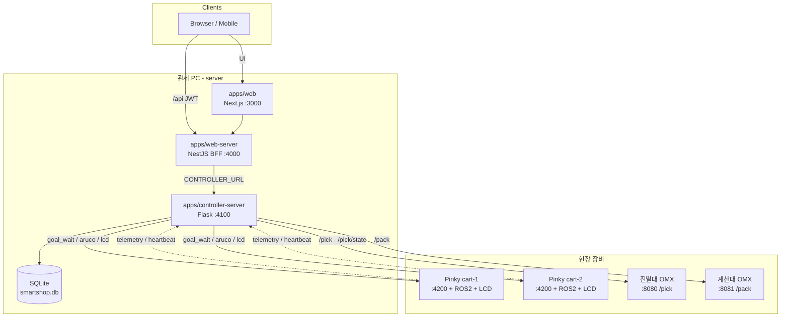

- **Web**: 고객·관리자 UI. DB 미접속.
- **BFF**: JWT, `/admin/*` 프록시, 업로드.
- **Controller**: 비즈니스·미션 투어·TrafficCoordinator·어댑터. **단일 DB 소유자**.

### 3.2 배포 토폴로지 (LAN)

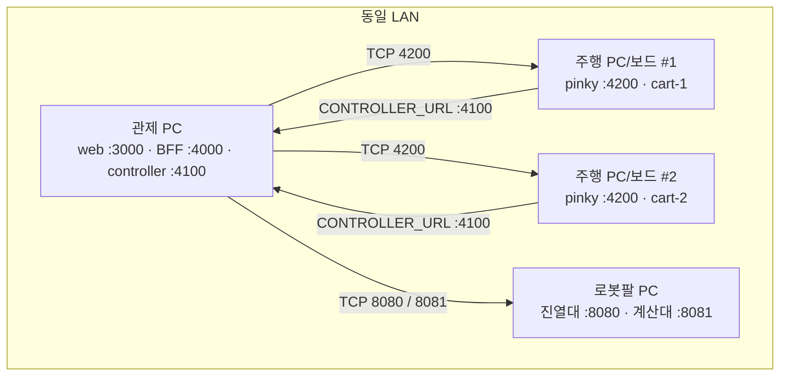

### 3.3 포트·프로세스 요약

| 포트 | 프로세스 | 위치 |
|------|----------|------|
| 3000 | Next.js web | 관제 PC |
| 4000 | Nest BFF | 관제 PC |
| 4100 | Flask controller | 관제 PC |
| 4200 | Pinky Flask (+ emotion_server) | 주행 로봇 PC(대당) |
| 8080 | OMX pick (진열대) | 로봇팔 PC |
| 8081 | OMX pack (계산대) | 로봇팔 PC |

---

## 4. 컴포넌트 UML (개념)

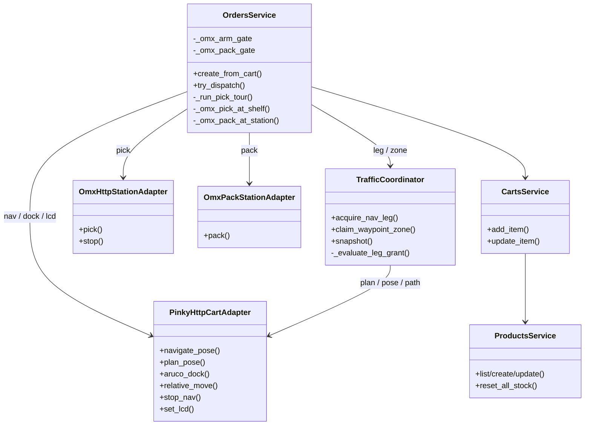

Pinky·OMX는 컨트롤러 입장에서 **포트(어댑터)** 로만 보이며, `ADAPTER_MODE=mock`이면 Mock으로 대체됩니다. `PACK_URL`이 없으면 계산대는 dwell만 수행합니다.

---

## 5. 데이터 모델 (ERD)

스키마 출처: `server/apps/controller-server/app/db.py`

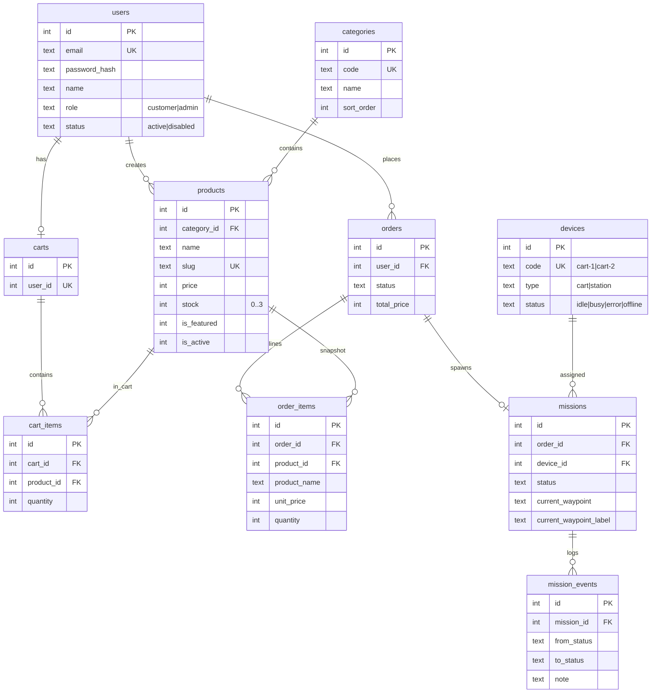

### 재고 규칙

- `PRODUCT_MAX_STOCK = 3` (OMX shelf capacity와 동일)
- 장바구니·주문 시 `quantity ≤ stock`
- 주문 생성 시 트랜잭션으로 `stock` 차감
- 관리자 `POST /admin/products/reset-stock` 또는 **관제 서버 기동 시** 전 상품 stock=3

---

## 6. 상태 다이어그램

### 6.1 주문·미션 상태

상수: `ORDER_FLOW` (`adapters.py`) · 전이: `OrdersService`

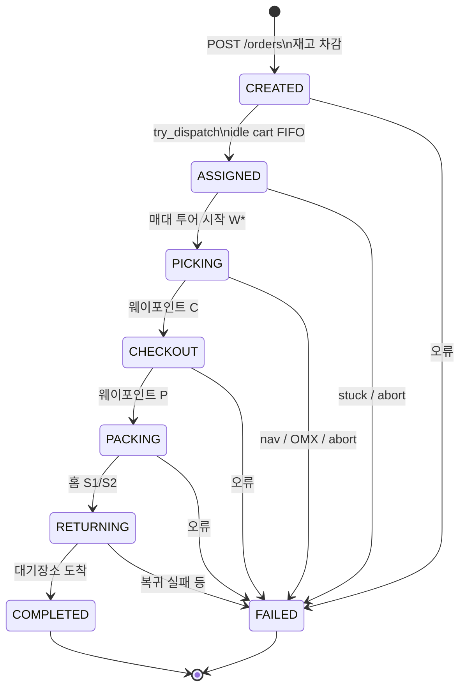

| 상태 | 의미 |
|------|------|
| CREATED | 큐 대기 (`QUEUED`는 레거시 호환 조회) |
| ASSIGNED | 카트 할당, 투어 스레드 기동 |
| PICKING | 매대 순회·도킹·OMX 픽 (FIFO) |
| CHECKOUT | 계산대 dock + pack OMX |
| PACKING | 운송대기 P |
| RETURNING | 홈 복귀 · LCD charging |
| COMPLETED / FAILED | 종료 |

### 6.2 교통 제어 로봇 phase

`TrafficCoordinator` (`traffic.py`)

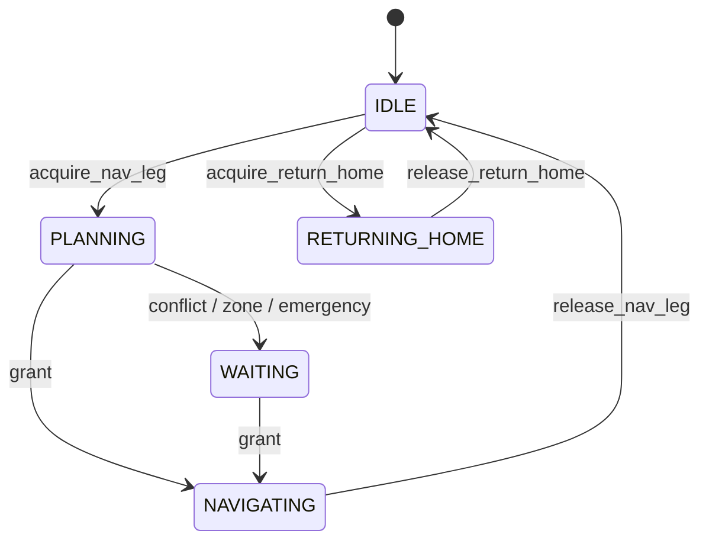

경로 충돌 시 owner 선정 요지: `can_clear` → sticky → progress → (동점) `mission_assigned_at` FIFO.  
상대가 **NAVIGATING** 중이고 내 pose가 그 경로에 걸치면 `emergency_wait`(제자리 대기). W7 스테이징은 존 대기용으로 유지.

### 6.3 OMX 픽업 job

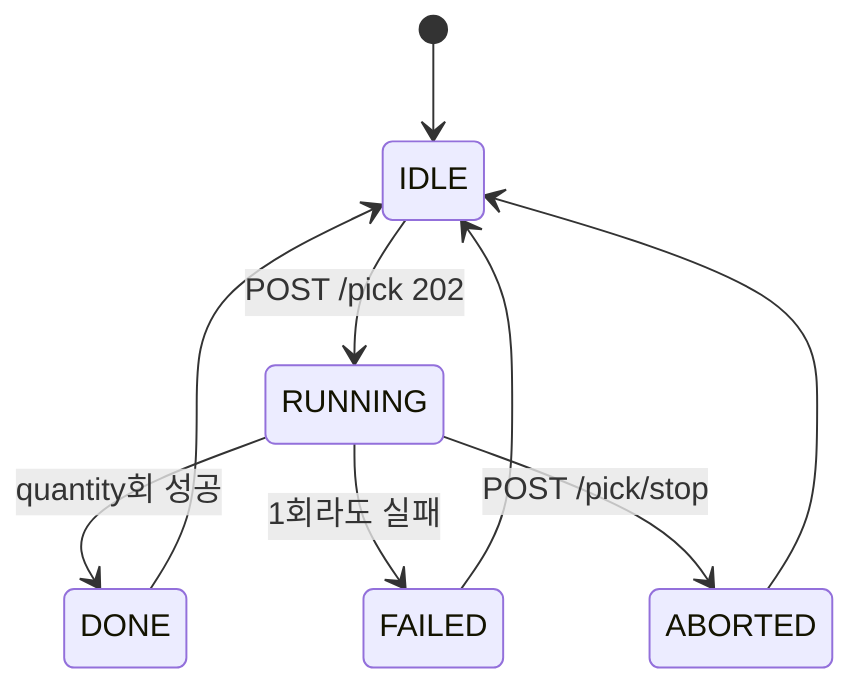

- busy 시 `POST /pick` → **409**
- `quantity ∈ 1..3`
- 관제는 `_OmxFifoGate`로 카트 간 pick/pack을 **도킹 완료 순 FIFO** 직렬화

---

## 7. 시퀀스 다이어그램

### 7.1 주문 → 미션 할당

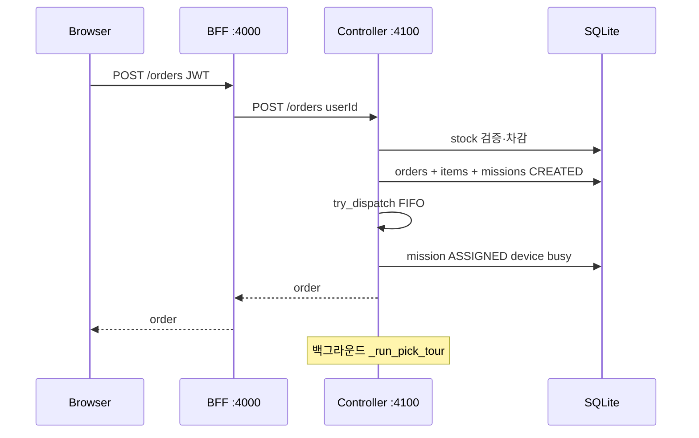

### 7.2 매대 1회: Nav → Dock → OMX(FIFO) → Undock

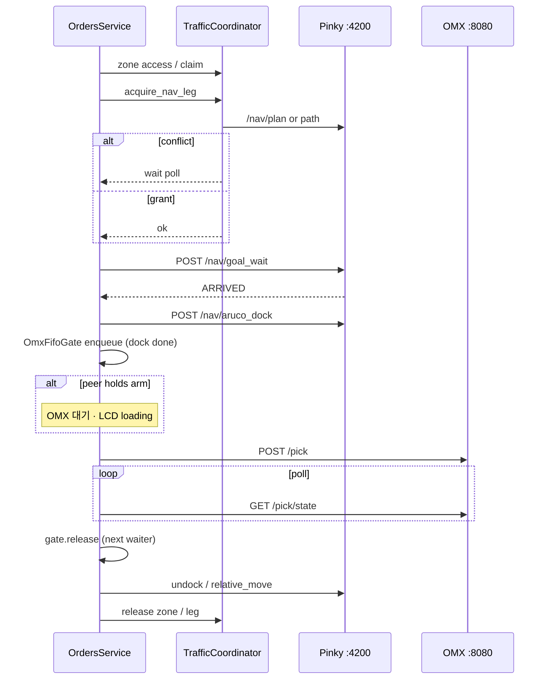

### 7.3 계산대: Dock → Pack

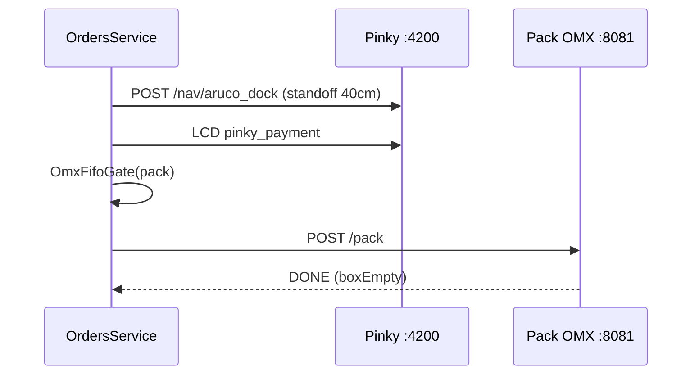

### 7.4 deviceCode → 적재함

| Controller `deviceCode` | OMX box |
|-------------------------|---------|
| cart-1 | box1 |
| cart-2 | box2 |

---

## 8. 패키지·디렉터리 구조

```
PS_project/
├── server/                          # 관제 + 쇼핑몰
│   ├── apps/
│   │   ├── web/                     # Next.js UI :3000
│   │   ├── web-server/              # Nest BFF :4000
│   │   └── controller-server/       # Flask :4100 + SQLite
│   │       └── app/
│   │           ├── services/        # orders, traffic, products, carts…
│   │           ├── adapters.py      # Pinky / OMX pick / OMX pack
│   │           ├── waypoints.py     # S/W/C/P + zone equivalents
│   │           └── db.py
│   ├── packages/shared/             # TS 공유 타입
│   └── .env.example
├── pinky/                           # 주행 로봇 서버 :4200
│   ├── run.py                       # emotion_server 자동 기동 + boot LCD
│   ├── server/                      # Flask routes (/actuators/lcd …)
│   ├── controllers/emotion_launch.py
│   ├── modules/backends/ros2.py     # Nav2 / ArUco
│   ├── modules/aruco_dock.py
│   └── start_ros2.sh
├── pinky_pro/                       # ROS2 패키지 (bringup / emotion GIFs)
│   └── pinky_emotion/emotion/       # *.gif (pinky_charging 등)
├── omx/
│   └── OMX_service_TS_Project/
│       ├── omx_yolo/                # 진열대 pick :8080 (YOLO+SmolVLA)
│       │   ├── annotate.py · convert.py · camera.py · server.py
│       ├── omx_pack/                # 계산대 pack :8081 (ACT)
│       │   ├── vocab.py · arm.py · boxcheck.py · server.py
│       ├── API.md
│       └── API_PACK.md
└── README.md                        # 본 문서
```

---

## 9. 주요 API 그룹

### 9.1 고객·관리자 (BFF `:4000`)

| 그룹 | 예시 |
|------|------|
| Auth | `POST /auth/login`, `GET /auth/me` |
| Catalog | `GET /products`, `GET /products/:id` |
| Cart | `GET/POST/PATCH /cart...` |
| Orders | `POST /orders`, `GET /orders/:id` |
| Admin | `/admin/products`, `POST /admin/products/reset-stock`, 로봇/미션/OMX |

### 9.2 관제 내부 (Controller `:4100`)

| 그룹 | 예시 |
|------|------|
| Domain | `/products`, `/orders`, `/carts/:userId`, `/missions` |
| Ops | reclaim, abort, return-home |
| Traffic | `GET /traffic/state` |

### 9.3 Pinky (`:4200`)

`/nav/goal_wait`, `/nav/plan`, `/nav/path`, `/nav/aruco_dock`, `/nav/aruco_undock`, `/nav/relative_move`, `/nav/stop`, `/actuators/lcd`, `/actuators/lcd/emotions`, `/health`, …

### 9.4 OMX

| 포트 | 예시 |
|------|------|
| `:8080` 진열대 | `POST /pick`, `GET /pick/state`, `POST /pick/stop`, `GET /health` |
| `:8081` 계산대 | `POST /pack`, 상태 폴링, `GET /health` (자세한 규격: `API_PACK.md`) |

---

## 10. 환경 변수 (핵심)

### 관제 PC — `server/.env`

| 변수 | 설명 |
|------|------|
| `CONTROLLER_URL` | BFF→Flask (`http://127.0.0.1:4100`) |
| `DATABASE_PATH` | SQLite 경로 |
| `PINKY_ROBOTS` | `cart-1=http://…:4200,cart-2=http://…:4200` |
| `OMX_URL` | 진열대 pick `http://<OMX-IP>:8080` |
| `PACK_URL` | 계산대 pack `http://<OMX-IP>:8081` (없으면 C dwell) |
| `ADAPTER_MODE` | `mock`이면 실기 어댑터 비활성 |
| `TRAFFIC_*` | 클리어런스, hold/release margin, W7, zone 반경 등 |
| `PICK_*` / `OMX_*` / `PACK_*` | Nav·dwell·픽/포장 타임아웃·busy 재시도 |
| `ARUCO_DOCK_STANDOFF_M` | 매대 기본 7cm |
| `ARUCO_DOCK_STANDOFF_C_M` | 계산대 기본 **40cm** |

### Pinky — `pinky/pinky.env`

| 변수 | 설명 |
|------|------|
| `PINKY_PORT` | 기본 4200 |
| `PINKY_BACKEND` | `ros2` \| `mock` |
| `PINKY_DEVICE_CODE` | `cart-1` / `cart-2` |
| `CONTROLLER_URL` | 관제 `:4100` |
| `PINKY_MAP` / `PINKY_AUTO_LAUNCH` | Nav2 맵·자동 bringup |
| `PINKY_AUTO_EMOTION` | `auto`면 `run.py`가 emotion_server 기동 |
| `PINKY_EMOTION_BOOT` | 기동 후 LCD (`pinky_charging`) |

### OMX — 로봇팔 PC

| 변수 | 설명 |
|------|------|
| `OMX_HOST` / `OMX_PORT` | 진열대 `0.0.0.0:8080` |
| pack 서버 | `:8081` (기동 스크립트·RUNBOOK 참고) |
| `POLICY` | VLA 체크포인트 (진열대 기동 스크립트) |

---

## 11. 기동 순서 (요약)

```bash
# 1) 관제 PC
cd server && cp .env.example .env   # PINKY_ROBOTS, OMX_URL, PACK_URL
# ADAPTER_MODE=mock 해제(실기)
pnpm install && pnpm --filter @smartshop/shared build
pnpm dev                            # :3000 :4000 :4100

# 2) 주행 로봇 PC (대당)
cd pinky && cp pinky.env.example pinky.env
# CONTROLLER_URL, PINKY_DEVICE_CODE, PINKY_BACKEND=ros2
# pinky_pro: colcon build --packages-select pinky_emotion (LCD GIF)
./start_ros2.sh                     # 또는 .venv/bin/python run.py
# run.py가 emotion_server 기동 + boot LCD charging

# 3) 로봇팔 PC
cd omx/OMX_service_TS_Project
POLICY=/path/to/ckpt ./scripts/start_server.sh   # :8080 pick
# pack 서버 :8081 (API_PACK.md / RUNBOOK)
```

데모 계정 (시드): `admin@smartshop.local` / `admin1234`, `customer@smartshop.local` / `customer1234`

---

## 12. 설계 원칙 요약

1. **관제가 오케스트레이터**: 주행·픽업·포장 하드웨어는 HTTP 워커에 가깝고, 순서·대기·재시도·LCD는 Controller가 담당.
2. **경로 분리 ≠ 재계획**: 충돌 시 Nav2 우회 재생성보다 **grant 대기·존·W7·투어 순서 조정**.
3. **팔은 FIFO 임계구역**: 진열대/계산대 각각 `_OmxFifoGate` — **먼저 도킹 완료한 카트**가 OMX 수행.
4. **재고는 주문 시점 확정**: 픽 성공과 무관하게 DB 차감; 데모는 리셋/재기동으로 복구.
5. **실패 시 안전**: 운영자 abort는 그 자리 정지; Nav 특정 abort는 후진 회복(단, 상대 NAVIGATING 경로 점유 시 비상대기).
6. **LCD는 관제+부팅**: emotion GIF는 `pinky_emotion`이 재생하고, 상태 전환은 관제/`run.py`가 `set_emotion`으로 지시.

---

## 13. 시행착오·교훈

충돌·데드락·로컬라이즈 붕괴·픽 실패로 이어질 수 있었던 **크리티컬** 사례를,  
**증상 → 원인 → 수정 → 근거자료 → 결과** 순으로 정리합니다.

- **관제(Controller):** `server/.../traffic.py`, `traffic_paths.py`, `orders.py`
- **Pinky 멀티로봇 현장 증거:** [`docs/pinky-trial-evidence/`](docs/pinky-trial-evidence/)  
  (로그 · RViz 캡처 · [수정 diff](docs/pinky-trial-evidence/diffs/))

### 13.0 대표 사례 한눈에

| 시행착오 | 원인 | 대응 | 증거 |
|----------|------|------|------|
| 경로 충돌·동시 통로 사용 | 겹치는 구간을 한 덩어리/희소점으로만 처리 | segment 분리 + densify + WAIT/RELEASE | [로그 01](docs/pinky-trial-evidence/logs/01_docking_conflict_localization_jump.txt) |
| 우선순위 역전 | conflict마다 owner 재계산 | Sticky Priority | [diff 02](docs/pinky-trial-evidence/diffs/02_sticky_priority_dock_pose_lock.diff) |
| 208 `NO_VALID_PATH` 후 후진/벽 접근 | 유효 path 없이 NavigateToPose fallback | Direct Goal fallback 제거 · WAIT | [이미지 02](docs/pinky-trial-evidence/images/02_rviz_wall_like_path.png) |
| Localization Pose Jump | 도킹 성공 오판 → goal 재전송 → AMCL 점프 | 7 cm DOCKED 판정 + watchdog + STOP BOTH | [이미지 01](docs/pinky-trial-evidence/images/01_rviz_cart2_pose_jump.png) |
| RViz 경로 잔상 | TRANSIENT_LOCAL path 미삭제 | HOLD/도착/미션 종료 시 path 정리 | [이미지 03](docs/pinky-trial-evidence/images/03_rviz_home_path_ghost.png) |
| 교통 타임아웃 fail-open | 대기 만료 후 강제 출발 | `TrafficTimeoutError` (강제 통과 없음) | 관제 `traffic.py` |
| 경로 위 후진 / X자 데드락 | peer path 위 후진·WAITING끼리 emergency_wait | 제자리 대기 · NAVIGATING일 때만 path 점유 | 관제 `orders.py` / `traffic.py` |
| 로컬라이즈 깨진 채 후진 | TF/AMCL 실패에도 retreat | 후진 조건 화이트리스트 | `_nav_error_needs_retreat` |
| 단일 OMX 동시 pick | 팔 1대에 카트 2 스레드 · Lock 불공정 | `_OmxFifoGate` (도킹 완료 FIFO) + 409 재시도 | `orders.py` |

---

### 13.1 충돌 segment 분리와 WAIT / RELEASE

**배경.** 두 Pinky가 동일 통로를 동시에 쓰면 Nav2 단독으로는 좁은 맵에서 우회가 거의 안 된다. 교통 계층이 경로를 먼저 뽑아 충돌을 보고, owner만 goal을 보낸다.

**잘못된 시도.** 겹침을 “한 줄짜리 긴 충돌”로만 보거나, 경로 **꼭짓점만** 비교하면 세그먼트 중간 교차가 빠진다(관제 densify 이슈와 동일 계열).

**현장 증상·로그.** 실제 세션에서 conflict가 **2개 segment**로 쪼개지고, owner가 EXIT+margin을 지난 뒤에야 waiter가 RELEASE·REPLAN 된다.

```text
[PATH CONFLICT] CART-1 <-> CART-2 segments=2 clearance=0.200m
[ACTIVE CONFLICT] segment 1/2 only; clear gaps stay CLEAR
[WAIT] CART-2
[EXIT] CART-1 passed current conflict EXIT + 0.20m
[POST-SEGMENT CONFLICT] remaining=1
[REPLAN OK] ...
[RELEASE] CART-2
```

전문: [`logs/01_docking_conflict_localization_jump.txt`](docs/pinky-trial-evidence/logs/01_docking_conflict_localization_jump.txt)

**관제 쪽 대응.** `find_path_conflicts` + densify, grant 시 sticky / `can_clear` / progress / FIFO. 타임아웃 시 **fail-open 금지** → `TrafficTimeoutError`(§13.7).

---

### 13.2 Sticky Priority (우선순위 역전)

**배경.** 충돌 segment가 바뀔 때마다 “EXIT에 더 가까운 쪽” 등으로 owner를 다시 고르면, 이미 달리던 로봇이 갑자기 WAIT로 떨어지고 뒤쪽이 선행하는 **우선순위 역전**이 난다.

**대응.**

```text
한 번 owner가 된 로봇
→ 관련 conflict에서도 우선권 유지(sticky)
→ owner가 막히거나 경로 실패일 때만 재선정
```

증거: [`diffs/02_sticky_priority_dock_pose_lock.diff`](docs/pinky-trial-evidence/diffs/02_sticky_priority_dock_pose_lock.diff)  
관제 `TrafficCoordinator`의 `conflict_owner_sticky`와 같은 정책 계열이다.

---

### 13.3 208 `NO_VALID_PATH`와 Direct Goal fallback 제거

**배경.** `/nav/plan`(ComputePathToPose)이 `errorCode=208`을 반복하면, 과거에는 “그래도 움직여 보라”며 **NavigateToPose를 직접** 보냈다.

**잘못된 시도·위험.**

```text
ComputePathToPose 실패
→ NavigateToPose 직접 전송
→ Nav2 recovery(후진 등)
→ 벽 접근 / 맵상 벽을 통과하는 것처럼 보이는 path
```

**현장 증거 (RViz).** 유효한 자유공간 경로가 아닌데 goal이 나가면, 계획이 벽을 가로지르는 것처럼 보인다.

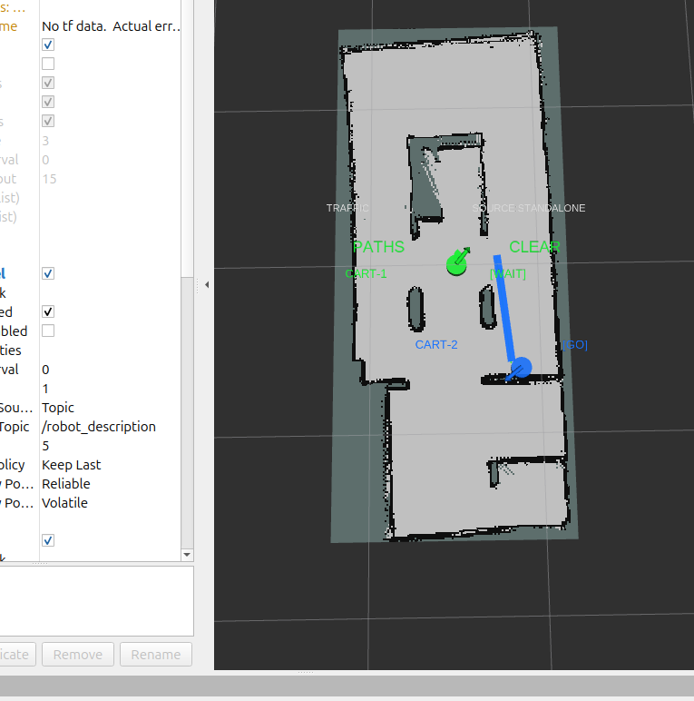

**개선 후 로그.**

```text
[TEMPORARY PLAN BLOCKED] CART-2: errorCode=208 (NO_VALID_PATH)
[NO DIRECT GOAL FALLBACK] CART-2: ComputePathToPose has no valid path;
robot remains WAIT. No NavigateToPose goal is sent until a valid Nav2 path exists.
[STATIONARY FALLBACK CHECK] ... SINGLE PATH WAIT ... no goal sent
```

전문: [`logs/02_208_wait_stationary_conflict.txt`](docs/pinky-trial-evidence/logs/02_208_wait_stationary_conflict.txt)  
Diff: [`diffs/01_direct_goal_fallback_removed.diff`](docs/pinky-trial-evidence/diffs/01_direct_goal_fallback_removed.diff)

**결과.** 유효 Nav2 path가 생기기 전에는 goal을 보내지 않는다. 관제의 “fail-open 금지”·“경로 위 후진 금지”와 같은 안전 철학이다.

---

### 13.4 도킹 성공 오판 → Localization Hard Jump

**배경.** CART-2가 HOME에 약 **0.061 m**까지 접근하고 Nav2가 `SUCCEEDED`를 반환했는데, 기존 로직이 거리 판정 때문에 **실패로 오판**하고 goal을 재전송했다.

**연쇄.**

```text
[DOCKING OWNER NAV BLOCKED] ... (action=SUCCEEDED); retry 1
[DOCKING OWNER RETRY] CART-2 -> HOME goal resent
[LOCALIZATION HARD JUMP] CART-2: 1.709m in 2.000s (0.855m/s > 0.750m/s)
[LOCALIZATION LOST]
[SAFETY FAULT] ...
[STOP BOTH]
```

**현장 증거 (RViz).** AMCL pose가 실제 이동과 무관한 거리로 점프한 순간.

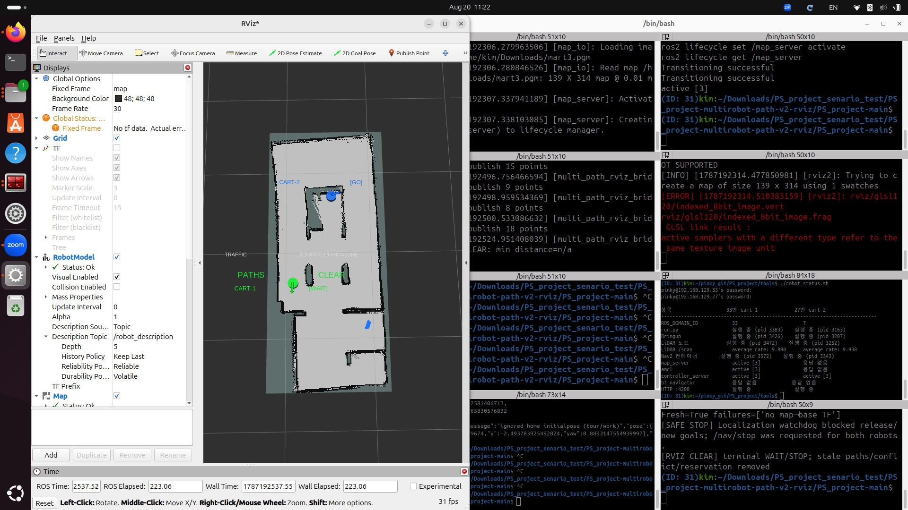

**대응.**

```text
Nav2 action == SUCCEEDED
AND navigating == false
AND distance <= 0.07 m
→ DOCKED
```

+ localization watchdog(비현실적 속도·점프 시 `/nav/stop` both)  
+ 도킹 완료 Pose Lock  

Diff: [`diffs/04_docking_success_7cm.diff`](docs/pinky-trial-evidence/diffs/04_docking_success_7cm.diff)  
로그 동일: [`logs/01_...`](docs/pinky-trial-evidence/logs/01_docking_conflict_localization_jump.txt)

**관제 쪽 연관.** 로컬라이즈/TF 실패 메시지에서는 **후진 회복을 하지 않는다**(§13.8). pose가 틀린 상태에서 `cmd_vel`을 주면 벽으로 밀린다.

---

### 13.5 RViz 경로 잔상

**배경.** 사용이 끝난 TRANSIENT_LOCAL reference path가 RViz에 굵게 남아, **현재 쓸 경로와 혼동**됐다. 디버깅·데모 모두에서 “왜 저쪽으로 가라고 했지?” 오판을 유발한다.

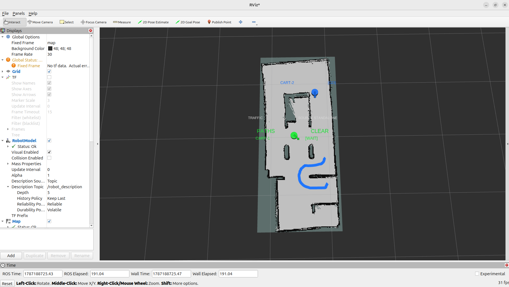

**대응.** Replan 시 이전 path 교체 · HOLD/목적지 도착 시 해당 path 삭제 · 미션 종료 시 path/conflict/reservation 전체 정리.

Diff: [`diffs/03_rviz_path_lifecycle_release.diff`](docs/pinky-trial-evidence/diffs/03_rviz_path_lifecycle_release.diff)

---

### 13.6 HOME 순차 진입 · 서비스 지점 점유

**HOME (S1/S2).** 대기장소가 가까워 두 대가 동시에 붙으면 footprint가 겹친다. 로그상 owner가 DOCKED될 때까지 다른 카트는 HOLD, 이후 순차 HOME.

**서비스 웨이포인트 (W*).** 한 대가 정차한 뒤 다른 대의 계획이 정지 로봇에 **~수 cm**까지 붙으면:

```text
[STATIONARY ROBOT CONFLICT]
[PATH BLOCKED] / [SINGLE PATH WAIT]
```

정책 방향: 장소 상태 `FREE → APPROACHING → DOCKING → OCCUPIED → LEAVING → FREE`, 점유 중이면 다른 대는 SERVICE_HOLD.  
관제의 **존(zone) claim / W7 스테이징**이 같은 문제를 제품 투어에서 담당한다.

---

### 13.7 관제: 교통 타임아웃 fail-open · densify · emergency_wait

**fail-open.** 대기 상한 후 “그냥 출발”은 교차로 동시 진입을 만든다 → `TrafficTimeoutError`만 허용, 강제 통과 없음.

**희소 점 충돌.** 꼭짓점만 비교하면 세그먼트 교차 false-negative → `densify_path` + 점·세그먼트 거리.

**경로 위 후진.** peer active path 위에서 후진하면 상대 통행을 더 막음 → `_emergency_wait_on_peer_path`(제자리).

**X자 데드락.** WAITING끼리도 emergency_wait를 걸면 상호 고정 → **peer가 `NAVIGATING`이고 `active_path`가 있을 때만** 경로 점유로 판정.

---

### 13.8 관제: 로컬라이즈 실패 시 후진 금지 · OMX 직렬화

**후진.** `_nav_error_needs_retreat`는 `error_code=102/105/108`, `aborted`, `no_valid_path` 등만 허용. `no_tf` / `localization` / `amcl seed` / `map→base` 는 금지(§13.4와 동일 교훈).

**OMX.** 팔 1대에 카트 투어 스레드가 동시에 `/pick` → 409·미션 실패. `_OmxFifoGate`(도킹 완료 FIFO) + busy 재시도로 임계구역 직렬화. 계산대 pack은 별도 `:8081` 게이트.

---

### 13.9 증거자료 인덱스

| 파일 | 내용 |
|------|------|
| [images/01_rviz_cart2_pose_jump.png](docs/pinky-trial-evidence/images/01_rviz_cart2_pose_jump.png) | Localization hard jump |
| [images/02_rviz_wall_like_path.png](docs/pinky-trial-evidence/images/02_rviz_wall_like_path.png) | 벽 통과처럼 보이는 path |
| [images/03_rviz_home_path_ghost.png](docs/pinky-trial-evidence/images/03_rviz_home_path_ghost.png) | 홈 복귀 경로 잔상 |
| [logs/01_...](docs/pinky-trial-evidence/logs/01_docking_conflict_localization_jump.txt) | segment RELEASE + pose jump |
| [logs/02_...](docs/pinky-trial-evidence/logs/02_208_wait_stationary_conflict.txt) | 208 WAIT + NO DIRECT GOAL |
| [diffs/](docs/pinky-trial-evidence/diffs/) | fallback 제거 · sticky · path lifecycle · 7 cm dock |

패키지 안내: [`docs/pinky-trial-evidence/README.md`](docs/pinky-trial-evidence/README.md)

---

## 14. 관련 문서

| 문서 | 내용 |
|------|------|
| [server/README.md](server/README.md) | API·env·개발 스크립트 상세 |
| [pinky/README.md](pinky/README.md) | Nav/ArUco API·ROS2 기동 |
| [omx/README.md](omx/README.md) | OMX 배치 |
| [omx/OMX_service_TS_Project/API.md](omx/OMX_service_TS_Project/API.md) | 진열대 Pick API |
| [omx/OMX_service_TS_Project/API_PACK.md](omx/OMX_service_TS_Project/API_PACK.md) | 계산대 Pack API |
| [docs/pinky-trial-evidence/](docs/pinky-trial-evidence/) | Pinky 멀티로봇 시행착오 증거(이미지·로그·diff) |
