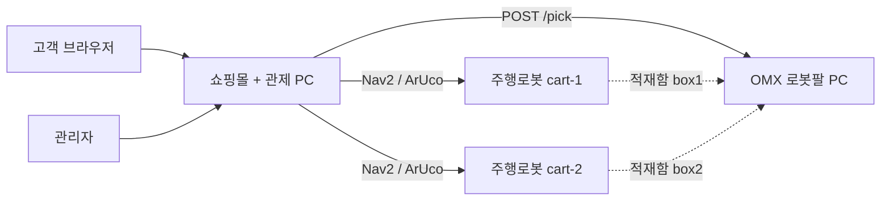
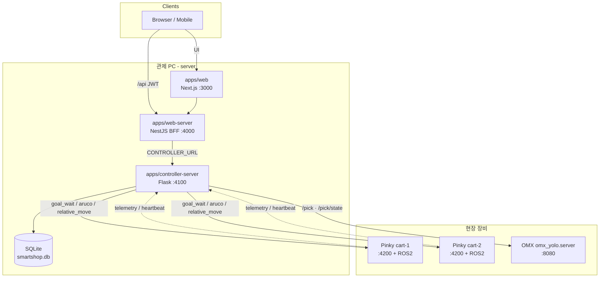
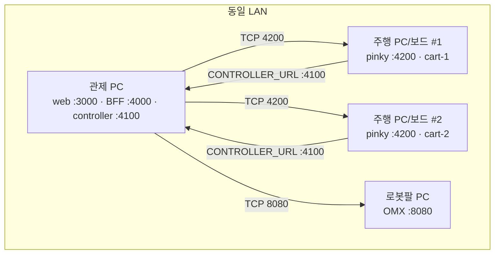
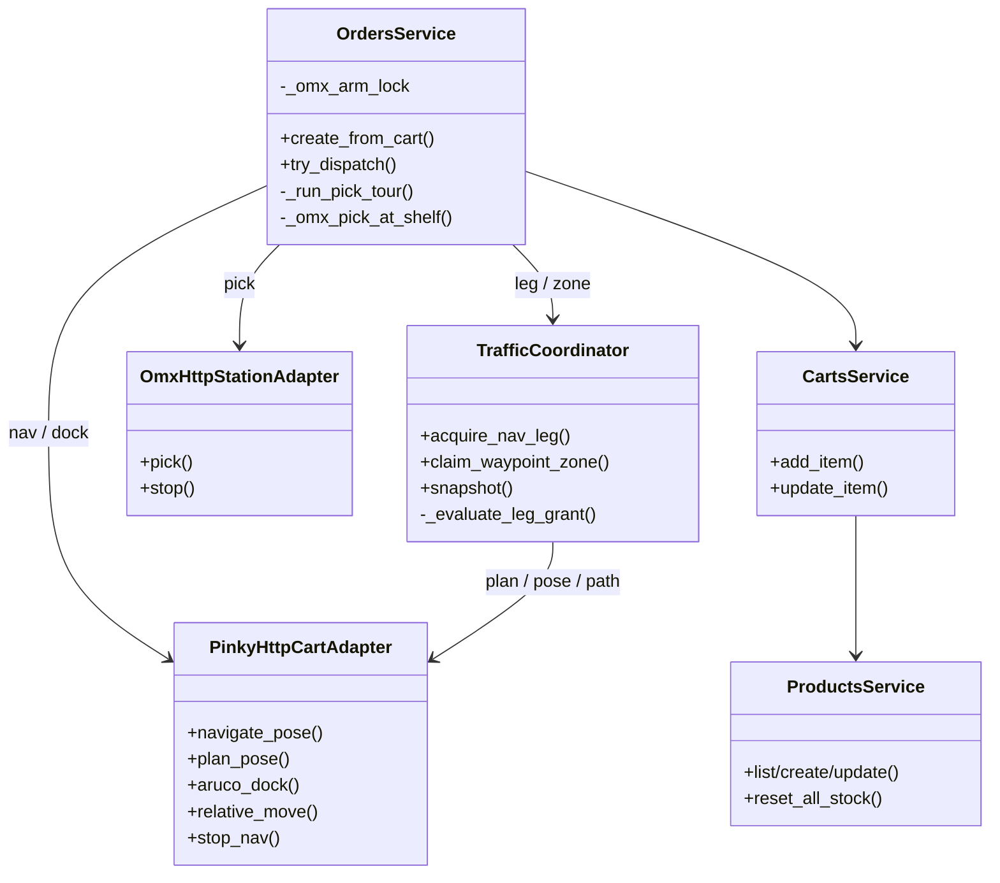
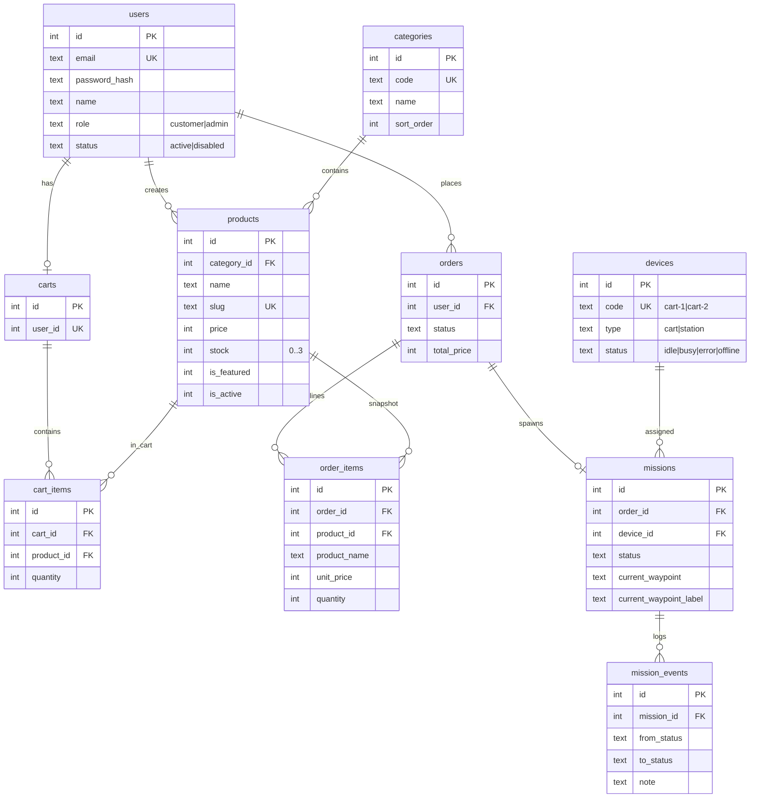
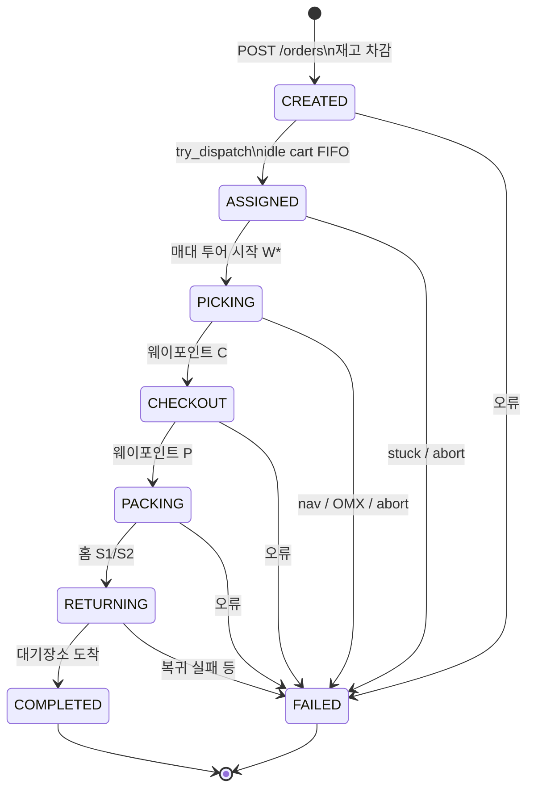
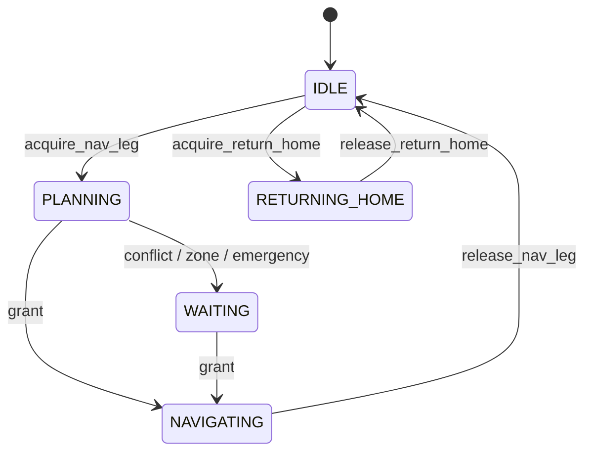
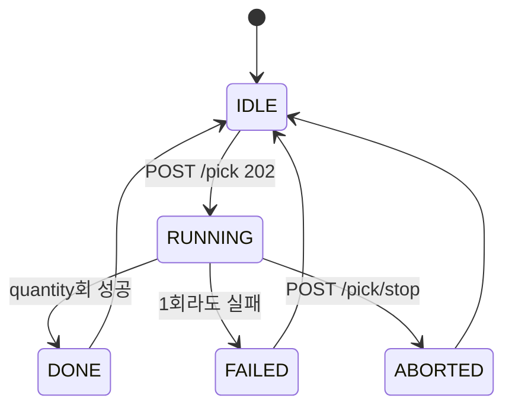
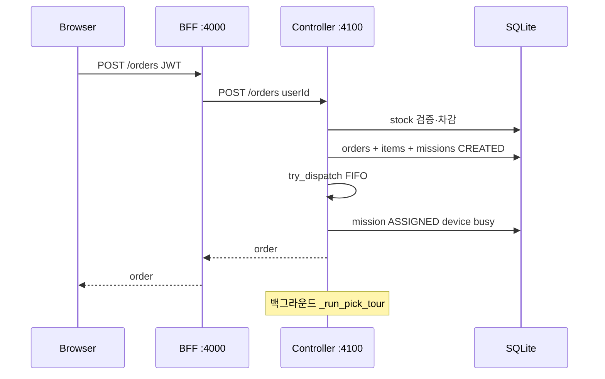
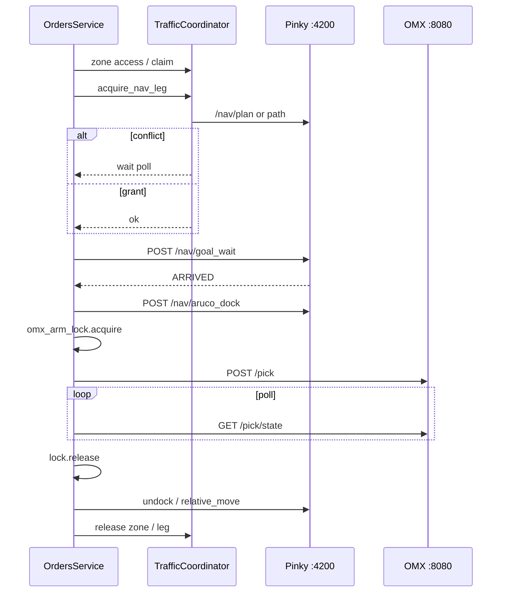

# PS_project

Pinky 주행 로봇과 OMX 로봇팔을 활용한 **무인마트 자동화 시스템**입니다.

고객이 웹에서 주문하면 관제 PC가 idle 카트에 미션을 할당하고, 카트는 매대(W1–W6) → 계산대(C) → 운송대기(P) → 대기장소(S1/S2)를 순회합니다. 매대에서는 ArUco 도킹 후 OMX 팔이 주문 수량만큼 카트 적재함에 상품을 담습니다.

| 디렉터리 | 역할 |
|----------|------|
| [`server/`](server/) | 쇼핑몰 UI · BFF · 관제(Flask) · SQLite |
| [`pinky/`](pinky/) | 주행 로봇 HTTP API + ROS2/Nav2 |
| [`omx/`](omx/) | 로봇팔 픽업 HTTP API (별도 PC) |

하위 상세: [server/README.md](server/README.md) · [pinky/README.md](pinky/README.md) · [omx/README.md](omx/README.md)

## 목차

1. [기본 구상](#1-기본-구상)
2. [주요 기능 상세](#2-주요-기능-상세)
3. [시스템 아키텍처](#3-시스템-아키텍처)
4. [컴포넌트 UML](#4-컴포넌트-uml-개념)
5. [데이터 모델 (ERD)](#5-데이터-모델-erd)
6. [상태 다이어그램](#6-상태-다이어그램)
7. [시퀀스 다이어그램](#7-시퀀스-다이어그램)
8. [패키지·디렉터리 구조](#8-패키지디렉터리-구조)
9. [주요 API 그룹](#9-주요-api-그룹)
10. [환경 변수](#10-환경-변수-핵심)
11. [기동 순서](#11-기동-순서-요약)
12. [설계 원칙](#12-설계-원칙-요약)
13. [관련 문서](#13-관련-문서)

---

## 1. 기본 구상

### 1.1 목표

- **무인 피킹·운반**: 주문 → 자동 할당 → 매대 픽업 → 계산·운송대기 → 홈 복귀
- **다로봇 병행**: 카트 2대 이상 동시 미션, 경로/존 충돌 시 한쪽 대기·W7 스테이징
- **단일 로봇팔**: OMX 팔 1대 → 카트 간 적재 작업 직렬화
- **재고·주문 연동**: 상품 최대 재고 3, 주문 시 차감, 관리자/서버 기동 시 재고 초기화

### 1.2 역할 분담



| 주체 | 담당 |
|------|------|
| 관제 PC (`server`) | 주문·재고·미션 FIFO·교통 제어·Pinky/OMX HTTP 오케스트레이션 |
| Pinky (`pinky`) | 로컬라이즈, Nav2 주행, ArUco 도킹/언독, 센서 |
| OMX (`omx`) | 매대 상품 인식·픽업·카트 박스 적재 (수량 1–3) |

### 1.3 맵 웨이포인트

| ID | 의미 | 비고 |
|----|------|------|
| S1 / S2 | cart-1 / cart-2 대기장소(홈) | 미션 시작·종료 |
| W1–W6 | 매대 | slug: cake, roll-cake, milk, biscuit, ice-cream, sandwich |
| C | 계산대 | dwell |
| P | 운송대기 | 상대 홈 복귀 중이면 W7 대기 후 진입 |
| W7 | 교통 스테이징 | 존/충돌 대기 시 바닥에서 이동 |

---

## 2. 주요 기능 상세

### 2.1 고객 쇼핑몰 (Web)

구현: `server/apps/web`

| 기능 | 설명 |
|------|------|
| 상품 브라우징 | 카테고리·피처드(히어로)·상세. slug로 매대와 연결 |
| 장바구니 | 로그인 카트(DB) / 비로그인 게스트(로컬). 로그인 시 merge |
| 수량 제한 | UI·API 모두 `quantity ≤ stock` 및 상한 3 |
| 주문 | `POST /orders` → 미션 생성·카트 비움·즉시 디스패치 시도 |
| 주문 조회 | 주문·미션 상태·현재 웨이포인트 표시 |

고객은 재고가 있는 수량만 담을 수 있으며, 품절(`stock=0`)이면 담기 버튼이 비활성됩니다.

### 2.2 관리자 (Admin)

구현: `server/apps/web` `/admin/*` · BFF AdminGuard

| 기능 | 설명 |
|------|------|
| 상품 CRUD | 이름, **slug**(W1–W6 매칭), 가격, 재고(0–3), 이미지, 히어로·활성 |
| 재고초기화 | 전 상품 `stock=3` (`POST /admin/products/reset-stock`) |
| 주문·미션 모니터링 | 상태·할당 카트·현재 웨이포인트 |
| 로봇 운영 | 텔레메트리, 강제 정지(abort), 홈 복귀, 맵/센서 프록시 |

slug 예: `cake`→W1, `roll-cake`→W2, `milk`→W3, `biscuit`→W4, `ice-cream`→W5, `sandwich`→W6.

### 2.3 주문 생성·재고 차감

구현: `OrdersService.create_from_cart` · `CartsService` · `constants.PRODUCT_MAX_STOCK`

1. 장바구니 각 라인 `qty ≤ stock`·`qty ≤ 3` 검증  
2. 같은 트랜잭션에서 `UPDATE products SET stock = stock - qty`  
3. `orders` / `order_items`(이름·단가 스냅샷) / `missions(CREATED)` 삽입  
4. 카트 비운 뒤 `try_dispatch`  

픽업 성공 여부와 무관하게 **주문 시점에 재고가 확정**됩니다. 데모 복구는 관리자 재고초기화 또는 관제 재기동(기동 시 stock=3).

### 2.4 미션 디스패치 (FIFO)

구현: `OrdersService.try_dispatch`

- 큐: `missions.status IN ('CREATED','QUEUED') AND device_id IS NULL`
- idle `devices`(type=cart)에 먼저 온 미션부터 할당 → `ASSIGNED`
- 카트당 백그라운드 `_run_pick_tour` 스레드
- `reclaim_stale_carts`: busy인데 활성 미션 없음 / ASSIGNED 장기 정체 → 복구·FAILED

### 2.5 피킹 투어 (매대 → C → P → 홈)

구현: `_run_pick_tour` · `waypoints.py`

```text
주문 라인 slug 집계
  → conflict_aware_tour_order (충돌 매대는 뒤로)
  → 각 W*: zone claim → Nav → ArUco dock → OMX pick(수량) → undock → zone release
  → C (dwell)
  → P (상대가 P→홈 중이면 W7 대기 후 진입)
  → S1/S2 (RETURNING → COMPLETED)
```

| 단계 | 동작 |
|------|------|
| Nav | `TrafficCoordinator.acquire_nav_leg` 후 Pinky `goal_wait` |
| Dock | `POST /nav/aruco_dock` (마커 ID는 웨이포인트별) |
| Pick | `_omx_arm_lock` 하에서 OMX `quantity`회 적재 |
| Undock | `relative_move` / aruco_undock (접근 거리 기반) |
| 실패 | 가능하면 홈 복귀 후 FAILED; 운영자 abort는 **그 자리 정지** |

### 2.6 다중 로봇 교통 제어

구현: `TrafficCoordinator` · `traffic_paths.py` · `GET /traffic/state`

**활성화:** `TRAFFIC_ENABLED` + 등록 로봇 ≥ 2대.

| 메커니즘 | 설명 |
|----------|------|
| 경로 충돌 검사 | densify + 점·세그먼트 거리, `TRAFFIC_CLEARANCE_M` |
| Leg grant | 겹치면 owner만 진행, waiter는 `WAITING` 폴링 (Nav 재계획으로 우회하지 않음) |
| Owner 선정 | `can_clear`(EXIT+release margin) → sticky → progress → **동점 시** mission FIFO |
| emergency_wait | 상대가 **NAVIGATING**이고 내 pose가 그 경로에 걸릴 때 제자리 대기(후진 회피 대체) |
| Zone | W1–W6/C/P 점유 disc; 다른 로봇 경로가 zone을 지나면 grant 보류 |
| W7 스테이징 | 홈이 아닌데 존이 막히면 W7로 이동 후 대기; 홈이면 제자리 대기 |
| 홈 복귀 | S1/S2 순차 (`TRAFFIC_HOME_PRIORITY`) |
| P 진입 | 상대 `returning_home`이면 P 진입 카트는 W7에서 대기 |

모니터링 필드 예: `phase`, `releaseIndex`, `holdIndex`, `conflictOwnerSticky`, `lastWaitReason`, `occupiedWaypoint`.

### 2.7 OMX 로봇팔 적재

구현: `OmxHttpStationAdapter` · OMX `omx_yolo.server` · `_omx_pick_at_shelf`

| 항목 | 내용 |
|------|------|
| 트리거 | 매대 ArUco 도킹 완료 후 |
| API | `POST /pick` → `GET /pick/state` 폴링 → 필요 시 `/pick/stop` |
| 수량 | 주문 합산 qty, 관제에서 1–3 클램프 (OMX `SHELF_CAPACITY`) |
| 단일 팔 | 서버 busy→409 + 관제 `_omx_arm_lock` (다른 카트는 락 대기) |
| deviceCode | `cart-1`→box1, `cart-2`→box2 |
| 통신 실패 | `force_success_on_unreachable` 시 노트 남기고 투어 계속(데모용) |
| Mock | `ADAPTER_MODE=mock` 또는 `OMX_URL` 없으면 dwell만 |

### 2.8 Pinky 주행·도킹

구현: `pinky/` Flask + `Ros2Backend`

| 기능 | 설명 |
|------|------|
| Nav2 | `goal` / `goal_wait`, plan/path, initialpose, stop |
| 로컬라이즈 | AMCL; idle 시 freeze로 pose 점프 완화 |
| ArUco dock | SEARCH→FACE→SHIFT→APPROACH |
| 미세 이동 | `relative_move` (언독·abort 후진 등) |
| Auto launch | `PINKY_AUTO_LAUNCH` 시 bringup + navigation 서브프로세스 |

관제는 `PinkyHttpCartAdapter`로 카트 URL별 HTTP 호출 (`PINKY_ROBOTS`).

### 2.9 운영·장애 복구

| 기능 | 설명 |
|------|------|
| Abort | Nav stop + 활성 미션 FAILED, 그 자리 유지 |
| Return home | 미션 정리 후 S1/S2로 복귀 |
| Reclaim | orphan busy / stuck ASSIGNED 정리 |
| Nav 재시도 | `PICK_NAV_RETRIES`; 특정 abort는 후진 회복 |
| Traffic timeout | 충돌 잔존 시 fail-open 없이 `TrafficTimeoutError` → 재시도 |

### 2.10 기능 ↔ 코드 매핑

| 기능 | 주요 위치 |
|------|-----------|
| 주문·투어 | `server/.../services/orders.py` |
| 교통 | `server/.../services/traffic.py`, `traffic_paths.py` |
| 재고·상품 | `products.py`, `carts.py`, `constants.py` |
| 웨이포인트 | `waypoints.py` |
| Pinky/OMX HTTP | `adapters.py` |
| Pinky Nav/ArUco | `pinky/modules/backends/ros2.py`, `pinky/server/routes.py` |
| OMX pick | `omx/.../omx_yolo/server.py`, `API.md` |
| 고객·관리 UI | `server/apps/web` |

---

## 3. 시스템 아키텍처

### 3.1 논리 계층



- **Web**: 고객·관리자 UI. DB 미접속.
- **BFF**: JWT, `/admin/*` 프록시, 업로드.
- **Controller**: 비즈니스·미션 투어·TrafficCoordinator·어댑터. **단일 DB 소유자**.

### 3.2 배포 토폴로지 (LAN)



### 3.3 포트·프로세스 요약

| 포트 | 프로세스 | 위치 |
|------|----------|------|
| 3000 | Next.js web | 관제 PC |
| 4000 | Nest BFF | 관제 PC |
| 4100 | Flask controller | 관제 PC |
| 4200 | Pinky Flask | 주행 로봇 PC(대당) |
| 8080 | OMX server | 로봇팔 PC |

---

## 4. 컴포넌트 UML (개념)



Pinky·OMX는 컨트롤러 입장에서 **포트(어댑터)** 로만 보이며, `ADAPTER_MODE=mock`이면 Mock으로 대체됩니다.

---

## 5. 데이터 모델 (ERD)

스키마 출처: `server/apps/controller-server/app/db.py`



### 재고 규칙

- `PRODUCT_MAX_STOCK = 3` (OMX shelf capacity와 동일)
- 장바구니·주문 시 `quantity ≤ stock`
- 주문 생성 시 트랜잭션으로 `stock` 차감
- 관리자 `POST /admin/products/reset-stock` 또는 **관제 서버 기동 시** 전 상품 stock=3

---

## 6. 상태 다이어그램

### 6.1 주문·미션 상태

상수: `ORDER_FLOW` (`adapters.py`) · 전이: `OrdersService`



| 상태 | 의미 |
|------|------|
| CREATED | 큐 대기 (`QUEUED`는 레거시 호환 조회) |
| ASSIGNED | 카트 할당, 투어 스레드 기동 |
| PICKING | 매대 순회·도킹·OMX 픽 |
| CHECKOUT | 계산대 |
| PACKING | 운송대기 P |
| RETURNING | 홈 복귀 |
| COMPLETED / FAILED | 종료 |

### 6.2 교통 제어 로봇 phase

`TrafficCoordinator` (`traffic.py`)



경로 충돌 시 owner 선정 요지: `can_clear` → sticky → progress → (동점) `mission_assigned_at` FIFO.  
상대가 **NAVIGATING** 중이고 내 pose가 그 경로에 걸치면 `emergency_wait`(제자리 대기). W7 스테이징은 존 대기용으로 유지.

### 6.3 OMX 픽업 job



- busy 시 `POST /pick` → **409**
- `quantity ∈ 1..3`
- 관제는 `_omx_arm_lock`으로 카트 간 pick 직렬화

---

## 7. 시퀀스 다이어그램

### 7.1 주문 → 미션 할당



### 7.2 매대 1회: Nav → Dock → OMX → Undock



### 7.3 deviceCode → 적재함

| Controller `deviceCode` | OMX box |
|-------------------------|---------|
| cart-1 | box1 |
| cart-2 | box2 |

---

## 8. 패키지·디렉터리 구조

```
PS_project/
├── server/                          # 관제 + 쇼핑몰
│   ├── apps/
│   │   ├── web/                     # Next.js UI :3000
│   │   ├── web-server/              # Nest BFF :4000
│   │   └── controller-server/       # Flask :4100 + SQLite
│   │       └── app/
│   │           ├── services/        # orders, traffic, products, carts…
│   │           ├── adapters.py      # Pinky / OMX HTTP
│   │           ├── waypoints.py
│   │           └── db.py
│   ├── packages/shared/             # TS 공유 타입
│   └── .env.example
├── pinky/                           # 주행 로봇 서버 :4200
│   ├── run.py
│   ├── server/                      # Flask routes
│   ├── modules/backends/ros2.py     # Nav2 / ArUco
│   └── start_ros2.sh
├── omx/
│   └── OMX_service_TS_Project/      # 로봇팔 API :8080
│       ├── omx_yolo/server.py
│       └── API.md
└── README.md                        # 본 문서
```

---

## 9. 주요 API 그룹

### 9.1 고객·관리자 (BFF `:4000`)

| 그룹 | 예시 |
|------|------|
| Auth | `POST /auth/login`, `GET /auth/me` |
| Catalog | `GET /products`, `GET /products/:id` |
| Cart | `GET/POST/PATCH /cart...` |
| Orders | `POST /orders`, `GET /orders/:id` |
| Admin | `/admin/products`, `POST /admin/products/reset-stock`, 로봇/미션 |

### 9.2 관제 내부 (Controller `:4100`)

| 그룹 | 예시 |
|------|------|
| Domain | `/products`, `/orders`, `/carts/:userId`, `/missions` |
| Ops | reclaim, abort, return-home |
| Traffic | `GET /traffic/state` |

### 9.3 Pinky (`:4200`)

`/nav/goal_wait`, `/nav/plan`, `/nav/path`, `/nav/aruco_dock`, `/nav/relative_move`, `/nav/stop`, `/health`, …

### 9.4 OMX (`:8080`)

`POST /pick`, `GET /pick/state`, `POST /pick/stop`, `GET /health`, `GET /products`

---

## 10. 환경 변수 (핵심)

### 관제 PC — `server/.env`

| 변수 | 설명 |
|------|------|
| `CONTROLLER_URL` | BFF→Flask (`http://127.0.0.1:4100`) |
| `DATABASE_PATH` | SQLite 경로 |
| `PINKY_URL` / `PINKY_ROBOTS` | 카트별 Pinky base URL |
| `OMX_URL` | `http://<OMX-IP>:8080` |
| `ADAPTER_MODE` | `mock`이면 실기 어댑터 비활성 |
| `TRAFFIC_*` | 클리어런스, hold/release margin, W7, zone 반경 등 |
| `PICK_*` / `OMX_*` | Nav·dwell·픽 타임아웃·busy 재시도 |

### Pinky — `pinky/pinky.env`

| 변수 | 설명 |
|------|------|
| `PINKY_PORT` | 기본 4200 |
| `PINKY_BACKEND` | `ros2` \| `mock` |
| `PINKY_DEVICE_CODE` | `cart-1` / `cart-2` |
| `CONTROLLER_URL` | 관제 `:4100` |
| `PINKY_MAP` / `PINKY_AUTO_LAUNCH` | Nav2 맵·자동 bringup |

### OMX — 로봇팔 PC

| 변수 | 설명 |
|------|------|
| `OMX_HOST` / `OMX_PORT` | `0.0.0.0:8080` |
| `POLICY` | VLA 체크포인트 (기동 스크립트) |

---

## 11. 기동 순서 (요약)

```bash
# 1) 관제 PC
cd server && cp .env.example .env   # PINKY_*, OMX_URL 설정
pnpm install && pnpm --filter @smartshop/shared build
pnpm dev                            # :3000 :4000 :4100

# 2) 주행 로봇 PC (대당)
cd pinky && cp pinky.env.example pinky.env
# CONTROLLER_URL, PINKY_DEVICE_CODE, PINKY_BACKEND=ros2
./start_ros2.sh                     # 또는 .venv/bin/python run.py

# 3) 로봇팔 PC
cd omx/OMX_service_TS_Project
POLICY=/path/to/ckpt ./scripts/start_server.sh
```

데모 계정 (시드): `admin@smartshop.local` / `admin1234`, `customer@smartshop.local` / `customer1234`

---

## 12. 설계 원칙 요약

1. **관제가 오케스트레이터**: 주행·픽업 하드웨어는 HTTP 워커에 가깝고, 순서·대기·재시도는 Controller가 담당.
2. **경로 분리 ≠ 재계획**: 충돌 시 Nav2 우회 재생성보다 **grant 대기·존·W7·투어 순서 조정**.
3. **팔은 전역 임계구역**: OMX 409 + 관제 `_omx_arm_lock`.
4. **재고는 주문 시점 확정**: 픽 성공과 무관하게 DB 차감; 데모는 리셋/재기동으로 복구.
5. **실패 시 안전**: 운영자 abort는 그 자리 정지; Nav 특정 abort는 후진 회복(단, 상대 NAVIGATING 경로 점유 시 비상대기).

---

## 13. 관련 문서

| 문서 | 내용 |
|------|------|
| [server/README.md](server/README.md) | API·env·개발 스크립트 상세 |
| [pinky/README.md](pinky/README.md) | Nav/ArUco API·ROS2 기동 |
| [omx/README.md](omx/README.md) | OMX 배치 |
| [omx/OMX_service_TS_Project/API.md](omx/OMX_service_TS_Project/API.md) | Pick API 규격 |
