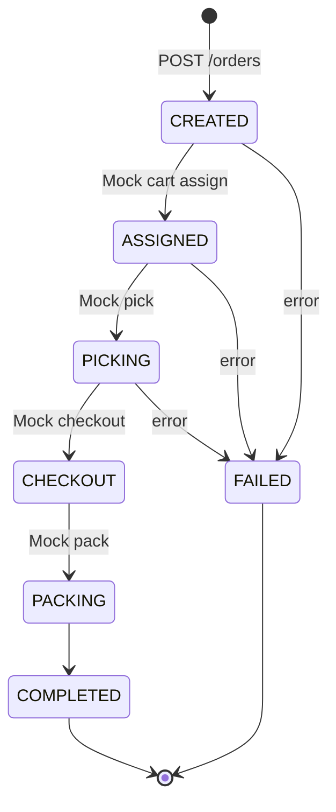

# SmartShop

무인 장보기 마트 **1차 데모** 프로젝트입니다.  
고객/관리자 통합 웹(UI) · Web Application Server(BFF) · Controller Server(관제·SQLite)를 TypeScript로 구성했으며, Robot/AI는 이후 연동을 위한 Mock 어댑터만 준비되어 있습니다.

> 실운영용이 아닙니다. 로컬 PC(동일 공유기 LAN 포함)에서 시나리오 데모를 돌리는 것을 목표로 합니다.

---

## 목차

1. [시스템 아키텍처](#1-시스템-아키텍처)
2. [레포 구조](#2-레포-구조)
3. [기술 스택](#3-기술-스택)
4. [ERD / DB 설계](#4-erd--db-설계)
5. [주요 기능](#5-주요-기능)
6. [API 개요](#6-api-개요)
7. [실행 방법](#7-실행-방법)
8. [LAN·모바일 접속](#8-lan모바일-접속)
9. [데모 계정·시드 데이터](#9-데모-계정시드-데이터)
10. [주문·미션 상태 흐름](#10-주문미션-상태-흐름)
11. [향후 확장](#11-향후-확장)

---

## 1. 시스템 아키텍처


### 호출 규칙

| From | To | 프로토콜 | 비고 |
|------|-----|----------|------|
| 브라우저 | Next.js (`:3000`) | HTTP | UI |
| 브라우저(클라) | Web Server (`:4000`) | HTTP | 인증·상품·카트·주문 API |
| Next.js | Web Server | HTTP / rewrite | SSR fetch, `/uploads/*` 프록시 |
| Web Server | Controller (`:4100`) | HTTP | DB·상태머신. **브라우저 직접 호출 금지** |
| Controller | Mock 어댑터 | in-process | 이후 Robot/AI HTTP로 교체 |

### 포트

| 프로세스 | 바인딩 | 포트 | 역할 |
|----------|--------|------|------|
| `apps/web` | `0.0.0.0` | **3000** | 고객 쇼핑 UI + `/admin` |
| `apps/web-server` | `0.0.0.0` | **4000** | JWT 인증, BFF, 파일 업로드 |
| `apps/controller-server` | `127.0.0.1` | **4100** | SQLite, 상품/주문/미션, Mock |

---

## 2. 레포 구조

```text
smartshop/
├── apps/
│   ├── web/                  # Next.js App Router (UI)
│   ├── web-server/           # NestJS BFF
│   └── controller-server/    # NestJS Control Center + SQLite
├── packages/
│   └── shared/               # 공용 타입, 카테고리 시드, 유틸
├── .env / .env.example
├── pnpm-workspace.yaml
└── package.json              # pnpm dev (concurrently)
```

| 경로 | 설명 |
|------|------|
| `apps/web/src/app` | 페이지: `/`, `/products/[id]`, `/cart`, `/login`, `/register`, `/admin` |
| `apps/web/src/components` | 히어로 슬라이드, 검색, 상품 그리드, 헤더 |
| `apps/web/src/lib` | API 클라이언트, 게스트 카트, 인증 컨텍스트 |
| `apps/web-server/src` | 공개 API · JWT 가드 · 업로드 · Controller 프록시 |
| `apps/controller-server/src/db` | 스키마·시드·매퍼 |
| `apps/controller-server/src/adapters` | Cart / Station / AI Port + Mock |
| `packages/shared` | `Product`, `OrderStatus`, `CATEGORY_SEEDS` 등 |

---

## 3. 기술 스택

| 영역 | 선택 |
|------|------|
| 언어 | TypeScript (Flask 미사용, 풀스택 통일) |
| 프론트 | Next.js 15 (App Router), React 19, Framer Motion |
| 스타일 | Cloud Dancer 톤 (`#F0EEE9`), Syne / Manrope |
| BFF / 관제 | NestJS 11 |
| DB | Node 내장 `node:sqlite` (experimental) — Windows native 빌드 불필요 |
| 인증 | JWT (`@nestjs/jwt`) + bcryptjs |
| 패키지 | pnpm workspace |

---

## 4. ERD / DB 설계

모든 영속 데이터는 **Controller의 SQLite** (`DATABASE_PATH`, 기본 `apps/controller-server/data/smartshop.db`)에만 둡니다.  
Web Server는 DB에 직접 붙지 않습니다.

### 4.1 ER 다이어그램

```mermaid
erDiagram
  users ||--o| carts : has
  users ||--o{ orders : places
  users ||--o{ products : creates
  categories ||--o{ products : contains
  carts ||--o{ cart_items : contains
  products ||--o{ cart_items : "in cart"
  orders ||--o{ order_items : contains
  products ||--o{ order_items : ordered
  orders ||--o| missions : spawns
  devices ||--o{ missions : assigned
  missions ||--o{ mission_events : logs

  users {
    int id PK
    text email UK
    text password_hash
    text name
    text role "customer|admin"
    text status "active|disabled"
    text created_at
    text updated_at
  }

  categories {
    int id PK
    text code UK
    text name
    int sort_order
    int is_active
  }

  products {
    int id PK
    int category_id FK
    text name
    text slug UK
    text description
    int price "KRW integer"
    int stock
    text image_full_url
    text image_zoom_url
    int is_featured
    int is_active
    int created_by FK
    text created_at
    text updated_at
  }

  carts {
    int id PK
    int user_id FK UK
    text updated_at
  }

  cart_items {
    int id PK
    int cart_id FK
    int product_id FK
    int quantity
  }

  orders {
    int id PK
    int user_id FK
    text status
    int total_price
    text created_at
    text updated_at
  }

  order_items {
    int id PK
    int order_id FK
    int product_id FK
    text product_name
    int unit_price
    int quantity
  }

  devices {
    int id PK
    text code UK
    text type "cart|station"
    text status "idle|busy|error|offline"
  }

  missions {
    int id PK
    int order_id FK
    int device_id FK
    text status
    text created_at
  }

  mission_events {
    int id PK
    int mission_id FK
    text from_status
    text to_status
    text note
    text created_at
  }
```

### 4.2 회원 / 관리자 (`users`)

회원과 관리자를 **테이블로 나누지 않고** `role` 구분자로 구분합니다.

| 컬럼 | 설명 |
|------|------|
| `role` | `'customer'` \| `'admin'` |
| `status` | `'active'` \| `'disabled'` |

- 회원가입 API는 항상 `customer`만 생성
- `admin`은 시드(또는 추후 승격)만 허용
- `/admin` 접근: `role === 'admin'` && `status === 'active'`

### 4.3 상품 이미지

| 필드 | 용도 |
|------|------|
| `image_full_url` | 전체 이미지 (그리드·상세·히어로 우측) |
| `image_zoom_url` | 확대 이미지 (히어로 좌측) |

규칙:

- 이미지가 **하나만** 등록되면 확대 슬롯에도 동일 소스 사용 + CSS 크롭/확대(`media-zoom`)
- 로컬 업로드는 **`/uploads/파일명` 상대 경로**로 저장 (LAN·hydration 안전)
- Next.js가 `/uploads/*` → Web Server(`:4000`)로 rewrite

### 4.4 장바구니

| 구분 | 저장소 |
|------|--------|
| 로그인 | `carts` / `cart_items` (유저당 카트 1개) |
| 비로그인 | 브라우저 `localStorage` 키 `smartshop.guestCart` |
| 로그인 시 | 게스트 카트 → 계정 카트로 **수량 합산 병합** |

### 4.5 주문 스냅샷

`order_items`의 `product_name`, `unit_price`는 주문 시점 스냅샷입니다. 이후 상품 수정과 무관합니다.

---

## 5. 주요 기능

### 고객 웹 (`/`)

- **Cloud Dancer** 오프화이트 톤, 반응형(모바일 드로어·그리드 재배치)
- 상단: 브랜드 · 마트 카테고리 · Bag · 로그인/회원가입 (admin이면 **상품 관리**)
- **히어로**: `is_featured` 상품 슬라이드, 가격 크게, 확대/전체 이미지 + 좌→우 패닝
- **검색바**: 히어로와 그리드 사이 (이름·카테고리)
- **상품 그리드**: 카드 탭/호버 시 **상세** / **장바구니** 버튼
- 상세 `/products/[id]`, 장바구니 `/cart`, 주문하기(로그인 필요)

### 관리자 (`/admin`)

- 상품 CRUD: 이름, 카테고리, 가격, 설명, 재고, 이미지, 히어로 노출, 판매 여부
- 이미지 URL 입력 또는 파일 업로드
- 저장 즉시 고객 홈 히어로·그리드·검색에 반영

### 관제 (Controller)

- 주문 생성 시 미션 생성 + Mock으로 상태 자동 진행  
  `CREATED → ASSIGNED → PICKING → CHECKOUT → PACKING → COMPLETED`
- `CartPort` / `StationPort` / `AiPort` 인터페이스 + Mock 구현 (`ADAPTER_MODE=mock`)

---

## 6. API 개요

### Web Server (공개, `:4000`)

| Method | Path | 설명 |
|--------|------|------|
| GET | `/health` | 헬스체크 |
| POST | `/auth/register` | 회원가입 → JWT |
| POST | `/auth/login` | 로그인 → JWT |
| GET | `/auth/me` | 내 정보 (Bearer) |
| GET | `/categories` | 카테고리 목록 |
| GET | `/products` | 상품 목록 (`q`, `category`, `featured`) |
| GET | `/products/:id` | 상품 상세 |
| GET/POST/PATCH/DELETE | `/cart...` | 로그인 카트 |
| POST | `/cart/merge` | 게스트 카트 병합 |
| POST | `/orders` | 주문 생성 |
| GET | `/orders/:id` | 주문 조회 |
| CRUD | `/admin/products` | 관리자 상품 (Admin 가드) |
| POST | `/admin/upload` | 이미지 업로드 → `{ url: "/uploads/..." }` |

### Controller (내부, `:4100`)

Web Server만 호출합니다. 예: `/users/*`, `/products`, `/carts/:userId`, `/orders`, `/devices`, `/categories`.

---

## 7. 실행 방법

### 요구 사항

- Node.js **20+** (권장 22/24, `node:sqlite` 사용)
- pnpm 11

### 설치·기동

```bash
pnpm install
pnpm --filter @smartshop/shared build
pnpm dev
```

개별 기동:

```bash
pnpm dev:controller   # :4100
pnpm dev:web-server   # :4000
pnpm dev:web          # :3000
```

환경 변수: 루트 [`.env.example`](.env.example) → `.env` 복사 후 사용.

| 변수 | 의미 |
|------|------|
| `WEB_SERVER_HOST` | 기본 `0.0.0.0` (LAN 공개) |
| `CONTROLLER_URL` | BFF → 관제 (`http://127.0.0.1:4100`) |
| `DATABASE_PATH` | SQLite 파일 경로 |
| `JWT_SECRET` | JWT 서명 키 |
| `UPLOAD_DIR` | 업로드 디렉터리 |
| `NEXT_PUBLIC_API_PORT` | 브라우저 API 포트 (기본 4000) |

---

## 8. LAN·모바일 접속

같은 공유기 Wi‑Fi의 휴대폰에서:

1. PC IPv4 확인 (`ipconfig`) — 예: `192.168.45.152`
2. 폰 브라우저: `http://192.168.45.152:3000`
3. Windows 방화벽 **인바운드 TCP 3000, 4000** 허용 (관리자 PowerShell 예시):

```powershell
netsh advfirewall firewall add rule name="SmartShop Web 3000" dir=in action=allow protocol=TCP localport=3000
netsh advfirewall firewall add rule name="SmartShop API 4000" dir=in action=allow protocol=TCP localport=4000
```

### 모바일에서 이미지가 안 보이거나 Hydration 에러가 나던 이유

| 문제 | 대응 |
|------|------|
| 서버가 `127.0.0.1`만 listen | 웹·API를 `0.0.0.0`으로 변경 |
| 업로드 URL이 `http://127.0.0.1:4000/...` | `/uploads/...` 상대 경로 저장 |
| SSR `src` ≠ 클라 `src` (hydration) | 이미지는 path-only + Next `/uploads` rewrite |
| Next cross-origin 경고 | `allowedDevOrigins`에 LAN 허용 |

---

## 9. 데모 계정·시드 데이터

### 계정

| 역할 | 이메일 | 비밀번호 |
|------|--------|----------|
| 관리자 | `admin@smartshop.local` | `admin1234` |
| 고객 | `customer@smartshop.local` | `customer1234` |

### 시드

- 카테고리 8종: 신선식품, 유제품, 음료, 스낵/과자, 즉석식품, 생활용품, 주방/세제, 헬스/뷰티
- 샘플 상품 12개 (일부 `is_featured`)
- 디바이스: `cart-1`, `cart-2`, `station-1`, `station-2`

DB 파일이 이미 있으면 시드는 다시 넣지 않습니다. 초기화하려면 SQLite 파일을 삭제 후 Controller를 재시작하세요.

---

## 10. 주문·미션 상태 흐름



각 전이는 `mission_events`에 기록됩니다.

---

## 11. 향후 확장

현재 제외·준비만 된 항목:

- Robot Server 실연동 (ROS2, UART, UDP 영상)
- AI Server 실연동 (`AiPort` → HTTP)
- 실결제, Redis, Docker/K8s 필수화
- 관제 지도·실시간 영상 대시보드

어댑터 경계:

```text
Controller
  ├─ Order / Mission 상태머신
  ├─ CartPort / StationPort / AiPort
  └─ adapters/mock  ← 지금
       (이후 robot-http, ai-http 로 교체)
```

---

## 라이선스 / 메모

교육·데모용 샘플입니다. JWT 시크릿·데모 비밀번호를 그대로 외부에 노출하지 마세요.
