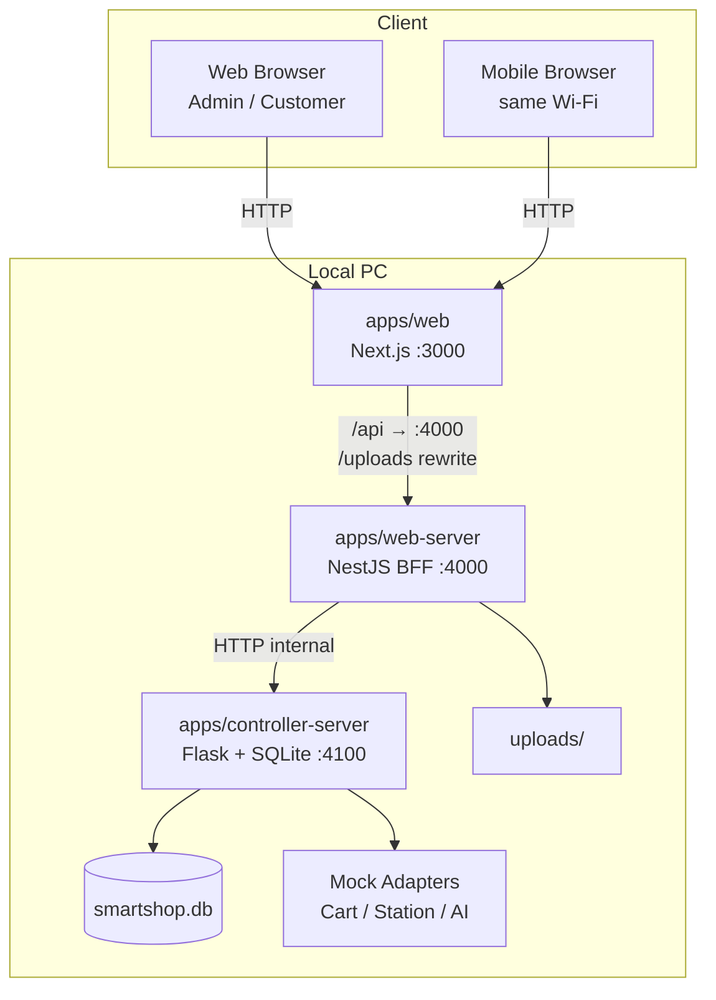
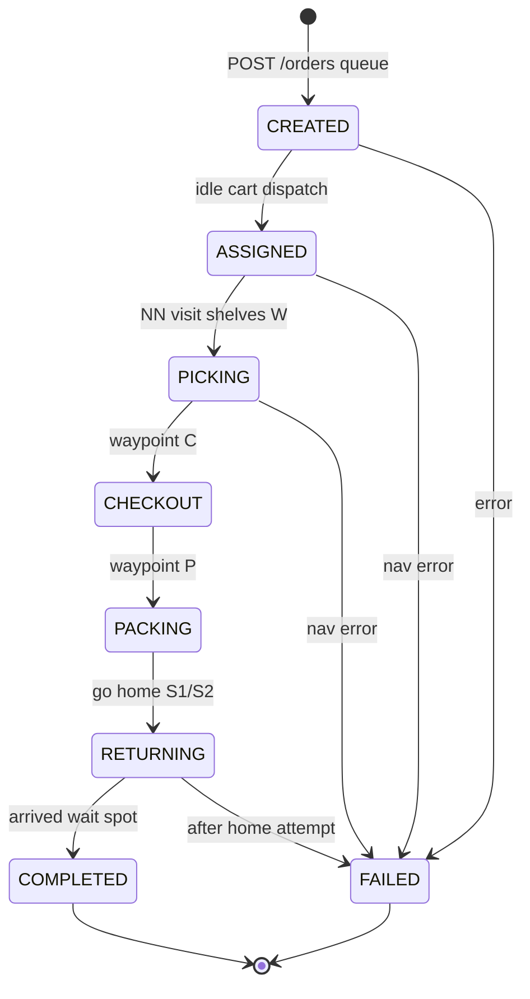

# SmartShop

무인 장보기 마트 **1차 데모** 프로젝트입니다.  
고객/관리자 통합 웹(UI)·Web Application Server(BFF)는 TypeScript, Controller Server(관제·SQLite)는 Flask로 구성했으며, Robot/AI는 이후 연동을 위한 Mock 어댑터만 준비되어 있습니다.

> 실운영용이 아닙니다. 로컬 PC(동일 공유기 LAN 포함)에서 시나리오 데모를 돌리는 것을 목표로 합니다.

---

## 목차

1. [시스템 아키텍처](#1-시스템-아키텍처)
2. [레포 구조](#2-레포-구조)
3. [기술 스택](#3-기술-스택)
4. [ERD / DB 설계](#4-erd--db-설계)
5. [주요 기능](#5-주요-기능)
6. [API 개요](#6-api-개요)
7. [실행 방법](#7-실행-방법)
8. [LAN·모바일 접속](#8-lan모바일-접속)
9. [데모 계정·시드 데이터](#9-데모-계정시드-데이터)
10. [주문·미션 상태 흐름](#10-주문미션-상태-흐름)
11. [향후 확장](#11-향후-확장)
12. [변경 내역](#12-변경-내역)

---

## 1. 시스템 아키텍처




### 호출 규칙


| From       | To                   | 프로토콜           | 비고                          |
| ---------- | -------------------- | -------------- | --------------------------- |
| 브라우저       | Next.js (`:3000`)    | HTTP           | UI                          |
| 브라우저(클라)   | Web Server (`:4000`) | HTTP           | 인증·상품·카트·주문 API             |
| Next.js    | Web Server           | HTTP / rewrite | SSR fetch, `/uploads/*` 프록시 |
| Web Server | Controller (`:4100`) | HTTP           | DB·상태머신. **브라우저 직접 호출 금지**  |
| Controller | Mock 어댑터             | in-process     | 이후 Robot/AI HTTP로 교체        |


### 포트


| 프로세스                     | 바인딩         | 포트       | 역할                               |
| ------------------------ | ----------- | -------- | -------------------------------- |
| `apps/web`               | `0.0.0.0`   | **3000** | 고객 쇼핑 UI + `/admin`              |
| `apps/web-server`        | `0.0.0.0`   | **4000** | JWT 인증, BFF, 파일 업로드              |
| `apps/controller-server` | `0.0.0.0` | **4100** | Flask 관제, SQLite, 상품/주문/미션 (공유기망 로봇 접속) |


---


## 2. 레포 구조

```text
smartshop/
├── apps/
│   ├── web/                  # Next.js App Router (UI)
│   ├── web-server/           # NestJS BFF
│   └── controller-server/    # Flask Control Center + SQLite
│       ├── run.py
│       ├── requirements.txt
│       ├── .venv/            # 로컬 venv (gitignore)
│       └── app/              # config, db, seed, routes, services, adapters
├── packages/
│   └── shared/               # 공용 타입, 카테고리 시드, 유틸 (TS)
├── .env / .env.example
├── pnpm-workspace.yaml       # web, web-server, packages/* 만 포함
└── package.json              # pnpm dev (concurrently + Flask controller)
```


| 경로                                        | 설명                                                                   |
| ----------------------------------------- | -------------------------------------------------------------------- |
| `apps/web/src/app`                        | 페이지: `/`, `/products/[id]`, `/cart`, `/login`, `/register`, `/admin` |
| `apps/web/src/components`                 | 히어로 슬라이드, 검색, 상품 그리드, 헤더                                             |
| `apps/web/src/lib`                        | API 클라이언트, 게스트 카트, 인증 컨텍스트                                           |
| `apps/web-server/src`                     | 공개 API · JWT 가드 · 업로드 · Controller 프록시                               |
| `apps/controller-server/app`              | Flask 앱 · 스키마·시드·서비스·라우트                                             |
| `apps/controller-server/app/adapters.py`  | Cart / Station / AI Mock                                             |
| `apps/controller-server/requirements.txt` | Flask 의존성                                                            |
| `packages/shared`                         | `Product`, `OrderStatus`, `CATEGORY_SEEDS` 등                         |


---


## 3. 기술 스택


| 영역  | 선택                                                 |
| --- | -------------------------------------------------- |
| 언어  | TypeScript (web / BFF) + Python (Controller)       |
| 프론트 | Next.js 15 (App Router), React 19, Framer Motion   |
| 스타일 | Cloud Dancer 톤 (`#F0EEE9`), Syne / Manrope         |
| BFF | NestJS 11                                          |
| 관제  | Flask + SQLite (`sqlite3`)                         |
| DB  | Controller SQLite (`DATABASE_PATH`)                |
| 인증  | JWT (`@nestjs/jwt`, BFF) + bcrypt (Controller)     |
| 패키지 | pnpm workspace (web·web-server) + pip (controller) |


---


## 4. ERD / DB 설계

모든 영속 데이터는 **Controller의 SQLite** (`DATABASE_PATH`, 기본 `apps/controller-server/data/smartshop.db`)에만 둡니다.  
Web Server는 DB에 직접 붙지 않습니다.

### 4.1 ER 다이어그램

```mermaid
erDiagram
  users ||--o| carts : has
  users ||--o{ orders : places
  users ||--o{ products : creates
  categories ||--o{ products : contains
  carts ||--o{ cart_items : contains
  products ||--o{ cart_items : "in cart"
  orders ||--o{ order_items : contains
  products ||--o{ order_items : ordered
  orders ||--o| missions : spawns
  devices ||--o{ missions : assigned
  missions ||--o{ mission_events : logs

  users {
    int id PK
    text email UK
    text password_hash
    text name
    text role "customer|admin"
    text status "active|disabled"
    text created_at
    text updated_at
  }

  categories {
    int id PK
    text code UK
    text name
    int sort_order
    int is_active
  }

  products {
    int id PK
    int category_id FK
    text name
    text slug UK
    text description
    int price "KRW integer"
    int stock
    text image_full_url
    text image_zoom_url
    int is_featured
    int is_active
    int created_by FK
    text created_at
    text updated_at
  }

  carts {
    int id PK
    int user_id FK UK
    text updated_at
  }

  cart_items {
    int id PK
    int cart_id FK
    int product_id FK
    int quantity
  }

  orders {
    int id PK
    int user_id FK
    text status
    int total_price
    text created_at
    text updated_at
  }

  order_items {
    int id PK
    int order_id FK
    int product_id FK
    text product_name
    int unit_price
    int quantity
  }

  devices {
    int id PK
    text code UK
    text type "cart|station"
    text status "idle|busy|error|offline"
  }

  missions {
    int id PK
    int order_id FK
    int device_id FK
    text status
    text created_at
  }

  mission_events {
    int id PK
    int mission_id FK
    text from_status
    text to_status
    text note
    text created_at
  }
```


### 4.2 회원 / 관리자 (`users`)

회원과 관리자를 **테이블로 나누지 않고** `role` 구분자로 구분합니다.


| 컬럼       | 설명                        |
| -------- | ------------------------- |
| `role`   | `'customer'` | `'admin'`  |
| `status` | `'active'` | `'disabled'` |


- 회원가입 API는 항상 `customer`만 생성
- `admin`은 시드(또는 추후 승격)만 허용
- `/admin` 접근: `role === 'admin'` && `status === 'active'`


### 4.3 상품 이미지


| 필드               | 용도                     |
| ---------------- | ---------------------- |
| `image_full_url` | 전체 이미지 (그리드·상세·히어로 우측) |
| `image_zoom_url` | 확대 이미지 (히어로 좌측)        |


규칙:

- 이미지가 **하나만** 등록되면 확대 슬롯에도 동일 소스 사용 + CSS 크롭/확대(`media-zoom`)
- 로컬 업로드는 `/uploads/파일명` **상대 경로**로 저장 (LAN·hydration 안전)
- Next.js가 `/uploads/*` → Web Server(`:4000`)로 rewrite
- 관제 재시작 시 업로드 이미지(`/uploads/…`)는 덮어쓰지 않음. 관리자가 추가한 상품도 비활성화하지 않음


### 4.4 장바구니


| 구분    | 저장소                                         |
| ----- | ------------------------------------------- |
| 로그인   | `carts` / `cart_items` (유저당 카트 1개)          |
| 비로그인  | 브라우저 `localStorage` 키 `smartshop.guestCart` |
| 로그인 시 | 게스트 카트 → 계정 카트로 **수량 합산 병합**                |


### 4.5 주문 스냅샷

`order_items`의 `product_name`, `unit_price`는 주문 시점 스냅샷입니다. 이후 상품 수정과 무관합니다.

---


## 5. 주요 기능


### 고객 웹 (`/`)

- **Cloud Dancer** 오프화이트 톤, 반응형(모바일 드로어·그리드 재배치)
- 상단: 브랜드 · 마트 카테고리 · Bag · 로그인/회원가입 (admin이면 **매장 관리**)
- **히어로**: `is_featured` 상품 슬라이드, 가격 크게, 확대/전체 이미지 + 좌→우 패닝
- **검색바**: 히어로와 그리드 사이 (이름·카테고리)
- **상품 그리드**: 카드 탭/호버 시 **상세** / **장바구니** 버튼
- 상세 `/products/[id]`, 장바구니 `/cart`, 주문하기(로그인 필요)


### 관리자 (`/admin` · 매장 관리)

- 상단 **매장 관리** → `/admin` (우측 사이드바로 하위 메뉴 이동)
- **로봇 모니터링** (`/admin`): 주행로봇별 패널(할당 주문·경유지·연결·배터리·초음파·IMU·Occupancy 맵). BFF `PINKY_ROBOTS` 또는 `PINKY_URL`(+`PINKY_URL_2`). 대기 큐 길이 표시.
- **상품 관리** (`/admin/products`): 상품 CRUD, 이미지 업로드, 히어로 노출
- 저장 즉시 고객 홈 히어로·그리드·검색에 반영


### 관제 (Controller, Flask)

- NestJS 관제를 **Flask**로 교체 (HTTP·JSON·SQLite 계약은 BFF와 동일하게 유지)
- 주문 생성 시 미션을 **FIFO 큐(`CREATED`)** 에 넣고, **idle 카트**에만 할당
- 할당 후 맵 웨이포인트 피킹 순회: 매대(W*) 가까운 순 → 계산대(C) → 운송대기(P) → 홈(S1/S2)
- 매대(W1–W6)는 도착 후 **OMX 픽업 완료(DONE)** 를 기다린 뒤 다음 작업 진행, C/P/S1/S2는 기존 **dwell** 유지 (`PICK_DWELL_SEC`)
- Pinky: `POST /nav/goal_wait` (Nav2 도착 대기). URL은 `PINKY_ROBOTS` / `PINKY_URL`+`PINKY_URL_2`
- 2대 동시 미션: `TrafficCoordinator`가 leg 전송 전 경로 충돌 검사·mission FIFO 우선순위·홈 복귀(S1/S2) 순차 제어 (`GET /traffic/state` 모니터링)
- 웨이포인트 **zone 점유**: 매대/계산대/운송대기 도킹~언독(C는 dwell 후) 구간을 disc로 등록; 다른 로봇 경로가 zone을 지나면 leg grant 보류
- **충돌 대기**: 동일 shelf 점유·remaining 교집합 시 waiter는 **홈(S1/S2)에 있으면 그 자리에서 대기**하고, 이미 매대 쪽이면 **W7**로 스테이징 후 재시도; 투어 순서는 `conflict_aware_tour_order`로 충돌 shelf를 뒤로 미룸
- **P 진입**: 다른 카트가 운송대기(P)에서 S1/S2로 복귀 중이면, P로 가려는 카트는 **W7에서 대기**하고 상대가 대기장소에 도착한 뒤에 진입
- **OMX 통신 불가 우회**: OMX 서버 미접속/폴링 예외 시 `omx-unreachable-override` 노트를 남기고 해당 매대 픽업을 성공으로 간주해 작업을 이어감
- 데모 상품: 케이크(W1)·롤케이크(W2)·우유(W3)·비스킷(W4)·아이스크림(W5)·샌드위치(W6)
- 의존성: `apps/controller-server/requirements.txt` + `.venv`

---


## 6. API 개요


### Web Server (공개, `:4000`)


| Method                | Path              | 설명                                  |
| --------------------- | ----------------- | ----------------------------------- |
| GET                   | `/health`         | 헬스체크                                |
| POST                  | `/auth/register`  | 회원가입 → JWT                          |
| POST                  | `/auth/login`     | 로그인 → JWT                           |
| GET                   | `/auth/me`        | 내 정보 (Bearer)                       |
| GET                   | `/categories`     | 카테고리 목록                             |
| GET                   | `/products`       | 상품 목록 (`q`, `category`, `featured`) |
| GET                   | `/products/:id`   | 상품 상세                               |
| GET/POST/PATCH/DELETE | `/cart...`        | 로그인 카트                              |
| POST                  | `/cart/merge`     | 게스트 카트 병합                           |
| POST                  | `/orders`         | 주문 생성                               |
| GET                   | `/orders/:id`     | 주문 조회                               |
| CRUD                  | `/admin/products` | 관리자 상품 (Admin 가드)                   |
| POST                  | `/admin/upload`   | 이미지 업로드 → `{ url: "/uploads/..." }` |
| GET                   | `/admin/robot/*`  | Pinky 센서/헬스/디바이스 프록시            |


### Controller (내부, Flask `:4100`)

Web Server만 호출합니다. 인증/JWT는 없고, BFF가 프록시합니다.


| Method                | Path                                          | 설명                       |
| --------------------- | --------------------------------------------- | ------------------------ |
| GET                   | `/health`                                     | 헬스체크                     |
| POST                  | `/users/register` · `/users/login`            | 회원 (bcrypt)              |
| GET                   | `/users/:id`                                  | 없으면 `null`               |
| GET                   | `/categories` · `/products` · `/products/:id` | 카탈로그                     |
| POST/PUT/PATCH/DELETE | `/products...`                                | 상품 CRUD                  |
| GET/POST/PATCH/DELETE | `/carts/:userId...`                           | 장바구니 · merge             |
| POST                  | `/orders` · GET `/orders/:id`                 | 주문 (생성 후 Mock 파이프라인)     |
| GET                   | `/devices`                                    | 디바이스 목록 (snake_case raw) |
| GET                   | `/traffic/state`                              | 다중 로봇 교통 상태 (phase, path, home owner) |


---


## 7. 실행 방법

Linux(Ubuntu/Debian 계열 기준)와 Windows 모두에서 동일하게 `pnpm` / Python venv로 기동합니다.

### 요구 사항


| 도구           | 버전                            | 용도                        |
| ------------ | ----------------------------- | ------------------------- |
| Node.js      | **20+** (권장 22/24)            | web · web-server          |
| pnpm         | **11** (`packageManager`과 맞춤) | 모노레포 설치·기동                |
| Python       | **3.10+**                     | controller-server (Flask) |
| python3-venv | (Linux)                       | Controller 가상환경           |


### 7.1 사전 설치 (Linux)

**Node.js** (NodeSource 예시, 또는 [nodejs.org](https://nodejs.org) / nvm):

```bash
# 예: Node 22 (Ubuntu/Debian)
curl -fsSL https://deb.nodesource.com/setup_22.x | sudo -E bash -
sudo apt-get install -y nodejs
node -v   # v20+ 확인
```

nvm을 쓰는 경우:

```bash
nvm install 22
nvm use 22
```

**pnpm** (corepack 권장 — Node 16.13+에 포함):

```bash
sudo corepack enable
corepack prepare pnpm@11.18.0 --activate
pnpm -v
```

corepack이 없거나 실패하면:

```bash
npm install -g pnpm@11
# 또는
curl -fsSL https://get.pnpm.io/install.sh | sh -
```

**Python + venv**:

```bash
sudo apt-get update
sudo apt-get install -y python3 python3-venv python3-pip
python3 --version   # 3.10+ 확인
```


### 7.2 사전 설치 (Windows 요약)

- [Node.js LTS](https://nodejs.org) 설치 후 PowerShell에서 `corepack enable` → `corepack prepare pnpm@11.18.0 --activate`
- Python 3.10+ 설치 시 **“Add python.exe to PATH”** 체크, 이후 `python -m venv` 사용 가능


### 7.3 설치·기동

저장소의 `server/` 디렉터리에서:

```bash
cd /path/to/PS_project/server

# 환경 변수
cp .env.example .env

# Node 패키지
pnpm install
pnpm --filter @smartshop/shared build

# Flask Controller venv
cd apps/controller-server
python3 -m venv .venv
.venv/bin/pip install -r requirements.txt
cd ../..

# 전체 기동 (web :3000 · BFF :4000 · Flask :4100)
pnpm dev
```

브라우저: [http://127.0.0.1:3000](http://127.0.0.1:3000)

개별 기동:

```bash
pnpm dev:controller   # Flask :4100 (venv 없으면 자동 생성·설치)
pnpm dev:web-server   # NestJS BFF :4000
pnpm dev:web          # Next.js :3000
```

`pnpm dev:controller`는 `apps/controller-server/.venv`가 없으면 venv 생성과 `pip install`을 한 뒤 `run.py`를 실행합니다.

### 7.4 환경 변수

루트 `[.env.example](.env.example)` → `.env` 복사 후 사용.


| 변수                     | 의미                                                      |
| ---------------------- | ------------------------------------------------------- |
| `WEB_SERVER_HOST`      | 기본 `0.0.0.0` (LAN 공개)                                   |
| `CONTROLLER_URL`       | BFF → 관제 (`http://127.0.0.1:4100`)                      |
| `CONTROLLER_HOST`      | 관제 bind (기본 `0.0.0.0`, 로봇 Wi‑Fi 접속용)                 |
| `CONTROLLER_PORT`      | 관제 포트 (기본 `4100`)                                       |
| `PINKY_URL`            | BFF/Controller → 1번 Pinky (`cart-1`)                         |
| `PINKY_URL_2`          | (선택) 2번 Pinky (`cart-2`)                                    |
| `PINKY_ROBOTS`         | (선택) `cart-1=url1,cart-2=url2` — 다대 등록 시 우선              |
| `OMX_URL`              | OMX 로봇팔 서버 URL (예: `http://127.0.0.1:8080`)                 |
| `OMX_POLL_SEC`         | OMX `/pick/state` 폴링 주기 초 (기본 `0.5`)                        |
| `OMX_PICK_TIMEOUT_SEC` | OMX 픽업 1회 타임아웃 초 (기본 `90`)                               |
| `PICK_DWELL_SEC`       | C/P/S1/S2 도착 후 대기 초 (기본 `3`)                              |
| `PICK_NAV_TIMEOUT_SEC` | Nav2 goal_wait 타임아웃 초 (기본 `180`)                          |
| `TRAFFIC_ENABLED`      | 다중 로봇 교통 제어 on/off (기본 `1`, `PINKY_ROBOTS` 2대 이상일 때 적용) |
| `TRAFFIC_CLEARANCE_M`  | 경로 충돌 판정 거리 m (기본 `0.20`)                              |
| `TRAFFIC_RELEASE_MARGIN_M` | owner가 충돌 구간 통과 후 추가 여유 m (기본 `0.20`)           |
| `TRAFFIC_POLL_HZ`      | waiter 폴링 주기 Hz (기본 `2.0`)                                 |
| `TRAFFIC_HOME_PRIORITY`| 홈 복귀 순서: `fifo` 또는 `cart-1` (기본 `fifo`)                 |
| `TRAFFIC_MISSION_TIMEOUT` | nav leg / 홈 복귀 acquire 대기 상한 초 (기본 `300`)           |
| `TRAFFIC_ZONE_RADIUS_M` | 웨이포인트 점유 zone 반경 m (기본 `0.45`, W1–W6/C/P 도킹~언독 구간) |
| `TRAFFIC_STAGING_WAYPOINT` | 충돌·동일 목적지 대기 스테이징 웨이포인트 id (기본 `W7`)          |
| `DATABASE_PATH`        | SQLite 경로 (Controller cwd 기준, 기본 `./data/smartshop.db`) |
| `JWT_SECRET`           | JWT 서명 키                                                |
| `UPLOAD_DIR`           | 업로드 디렉터리                                                |
| `NEXT_PUBLIC_API_PORT` | 브라우저 API 포트 (기본 4000)                                   |


### 7.5 문제 해결 (Linux)


| 증상                                        | 확인                                                                 |
| ----------------------------------------- | ------------------------------------------------------------------ |
| `externally-managed-environment` / pip 거부 | 시스템 pip 대신 **venv** 사용 (위 절차)                                      |
| `pnpm: command not found`                 | `corepack enable` 또는 `npm i -g pnpm@11`                            |
| `EACCES` / 글로벌 설치 권한                      | nvm·corepack 사용, `sudo npm -g`는 지양                                 |
| 포트 사용 중 (`Address already in use`)        | `ss -tlnp | grep -E '3000|4000|4100'` 후 해당 프로세스 종료                 |
| DB 초기화                                    | `rm -f apps/controller-server/data/smartshop.db*` 후 Controller 재시작 |


---


## 8. LAN·모바일 접속

같은 공유기 Wi‑Fi의 휴대폰에서:

1. PC IPv4 확인
  - **Linux**: `ip -4 addr show` 또는 `hostname -I`  
  - **Windows**: `ipconfig`  
   예: `192.168.45.152`
2. 폰 브라우저: `http://192.168.45.152:3000`
3. 방화벽에서 **TCP 3000, 4000** 허용

**Linux (ufw 예시):**

```bash
sudo ufw allow 3000/tcp
sudo ufw allow 4000/tcp
sudo ufw status
```

**Windows** (관리자 PowerShell):

```powershell
netsh advfirewall firewall add rule name="SmartShop Web 3000" dir=in action=allow protocol=TCP localport=3000
netsh advfirewall firewall add rule name="SmartShop API 4000" dir=in action=allow protocol=TCP localport=4000
```


### 모바일에서 이미지가 안 보이거나 Hydration 에러가 나던 이유


| 문제                                   | 대응                                       |
| ------------------------------------ | ---------------------------------------- |
| 서버가 `127.0.0.1`만 listen              | 웹·API를 `0.0.0.0`으로 변경                    |
| 업로드 URL이 `http://127.0.0.1:4000/...` | `/uploads/...` 상대 경로 저장                  |
| SSR `src` ≠ 클라 `src` (hydration)     | 이미지는 path-only + Next `/uploads` rewrite |
| Next cross-origin 경고                 | `allowedDevOrigins`에 LAN 허용              |


---


## 9. 데모 계정·시드 데이터


### 계정


| 역할  | 이메일                        | 비밀번호           |
| --- | -------------------------- | -------------- |
| 관리자 | `admin@smartshop.local`    | `admin1234`    |
| 고객  | `customer@smartshop.local` | `customer1234` |


### 시드

- 카테고리 8종: 신선식품, 유제품, 음료, 스낵/과자, 즉석식품, 생활용품, 주방/세제, 헬스/뷰티
- 샘플 상품 12개 (일부 `is_featured`)
- 디바이스: `cart-1`, `cart-2`, `station-1`, `station-2`

DB 파일이 이미 있으면 시드는 다시 넣지 않습니다. 초기화하려면 SQLite 파일을 삭제 후 Controller를 재시작하세요.

---


## 10. 주문·미션 상태 흐름



- 대기 큐: `missions.status=CREATED` and `device_id IS NULL` (FIFO)
- idle `cart-*`만 할당. 두 대 busy면 큐에 대기
- 웨이포인트: `app/waypoints.py` (S1/S2 홈, W1–W6 매대, C 계산대, P 운송대기)
- 매대(W1–W6)는 OMX 픽업 완료 기반 진행, C/P/S1/S2는 dwell 기본 3초 (`PICK_DWELL_SEC`)
- 작업 종료 시점: **대기장소(S1/S2) 도착 완료** 후 `COMPLETED` (모니터링 할당 해제). 복귀 중은 `RETURNING`
- 중도 실패 시에도 대기장소 복귀 시도 후 `FAILED`
- 각 전이는 `mission_events`에 기록. 모니터링은 `current_waypoint` 표시

DB에 이미 시드가 있어도 기동 시 데모 상품 6종을 upsert합니다(관리자 업로드 이미지 유지).
완전 초기화는 SQLite 파일 삭제 후 Controller 재시작.

---


## 11. 향후 확장

현재 제외·준비만 된 항목:

- Robot Server 실연동 (ROS2, UART, UDP 영상)
- AI Server 실연동 (`AiPort` → HTTP)
- 실결제, Redis, Docker/K8s 필수화
- 관제 지도·실시간 영상 대시보드

어댑터 경계:

```text
Controller (Flask)
  ├─ Order / Mission 상태머신
  ├─ Cart / Station / AI Mock (app/adapters.py)
  ├─ PinkyHttpCartAdapter (PINKY_URL 설정 시)
  └─ GET/PATCH /missions · PATCH /devices · /robot/telemetry
```

Pinky 로봇 서버 (`~/PS_project/pinky`, 기본 `:4200`)가 센서 모듈·Flask API로 Controller와 연동합니다. 자세한 내용은 [`pinky/README.md`](../pinky/README.md) 참고.
---


## 12. 변경 내역


### Controller NestJS → Flask


| 항목                 | 이전                                              | 이후                                          |
| ------------------ | ----------------------------------------------- | ------------------------------------------- |
| 관제 런타임             | NestJS (TypeScript) `:4100`                     | **Flask (Python)** `:4100`                  |
| 패키지 관리             | pnpm workspace (`@smartshop/controller-server`) | `requirements.txt` + `.venv`                |
| 워크스페이스             | `apps/*` 전부                                     | `apps/web`, `apps/web-server`, `packages/*` |
| DB                 | Node `node:sqlite`                              | Python 표준 `sqlite3`                         |
| 비밀번호 해시            | bcryptjs                                        | bcrypt (cost 10, 호환)                        |
| 주문 Mock 파이프라인      | async `void`                                    | 백그라운드 스레드                                   |
| BFF (`web-server`) | —                                               | **변경 없음** (`CONTROLLER_URL` 동일 계약)          |


기동: `pnpm dev:controller` → `apps/controller-server/.venv/bin/python run.py`  
(venv가 없으면 스크립트가 생성·의존성 설치 후 기동합니다.)

---


## 라이선스 / 메모

교육·데모용 샘플입니다. JWT 시크릿·데모 비밀번호를 그대로 외부에 노출하지 마세요.